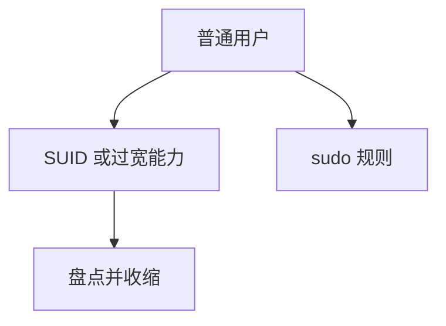

# Linux 提权路径

从普通用户到特权，常见路是：SUID 程序缺陷、能力过宽、sudo 规则、可写的服务配置、内核漏洞。硬化是收这些面，而不是研究如何走完一条路。

<footer>—— 据 Chen, Wagner 和 Dean 对 SUID 的讨论；Linux capabilities(7)；对照 Anderson</footer>

## 定位

上一课[SELinux](/cs/selinux-type-enforcement)假定策略在。缺口是**策略之外的提权面**：文件模式、能力、sudo。本课列机制与硬化，不给提权利用步骤。

后课默认已经读完本课钉下的合同，只补差，不从该领域第一性原理重开。

## 问题

setuid 位让程序以文件属主身份跑，程序洞即属主权。capabilities 把 root 劈开，给错仍过大。缺口是盘点 SUID、收 sudo、不可写服务文件。

### 内核

内核洞是另一条，补丁管理课已强调窗口。本课不讨论利用。

capabilities(7)。禁止提权教程。Windows Kerberos 下一课换域身份。

## 方法

清单：找 SUID、查能力、只读配置、无交互 root sudo。对照容器后课的逃逸面同源。

图中节点是本课的机制骨架；课程不把图展开成可运行的攻击步骤。

## 机制

最小特权在 Unix 上靠位与能力实现。域环境下一课用票据代替本地 root 叙事。

前提写进合同之后，游戏外的误用只当失败模式点名，不在本课写成操作程序。

## 边界

零利用。Windows Kerberos 攻击下一课讲协议失败模式与防御，不给操作步骤。

## 小结

- TE 之外，SUID/能力/sudo 仍是提权面。
- 硬化：盘点、收缩、只读配置。
- 内核窗口走补丁，不走利用课。
- 下一课 Kerberos 攻击面。
- 出处：Linux capabilities(7)；Anderson；Chen, Wagner and Dean。
