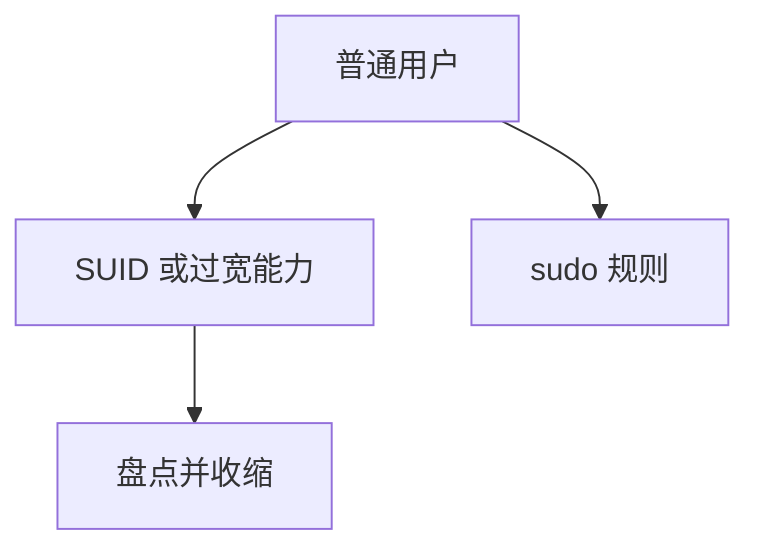
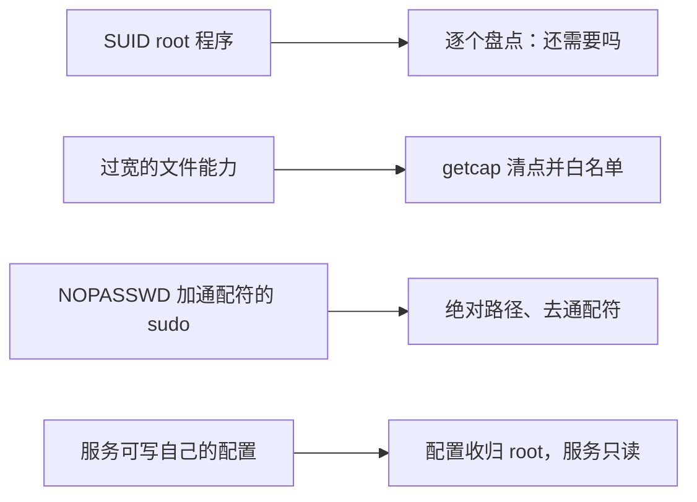

# Linux 提权路径

从普通用户到特权，常见路是：SUID 程序缺陷、能力过宽、sudo 规则、可写的服务配置、内核漏洞。硬化是收这些面，而不是研究如何走完一条路。

<footer>—— 据 Chen, Wagner 和 Dean 对 SUID 的讨论；Linux capabilities(7)；对照 Anderson</footer>

上一课[SELinux](/cs/selinux-type-enforcement)假定类型策略在位；策略之外还有一整层本地提权面。缺口是**策略之外的提权面**：文件模式、能力、sudo。本课列机制与硬化，不给提权利用步骤。

后课默认已经读完本课钉下的合同，只补差，不从该领域第一性原理重开。

## 问题

setuid 位让程序以文件属主身份跑：属主是 root，程序里任何一个洞即属主权——拿到普通 shell 的敌手第一件事就是翻 SUID 清单。capabilities 把 root 劈成 CAP_NET_ADMIN 等细项，方向正确，但给错仍过大：给守护进程 CAP_SYS_ADMIN 几乎等于把 root 还给它。sudo 规则是第三张面：`NOPASSWD` 加通配符的规则常被参数注入绕过。缺口是盘点 SUID、收能力、审 sudo，外加服务配置文件不可被服务账号写。

### 内核

内核洞是另一条路：普通用户即可打内核洞直达特权，不依赖任何配置错误。窗口问题补丁管理课已强调。本课不讨论利用。

术语翻译：SUID（setuid 位）是「运行此程序时暂时换上文件属主身份」的开关。属主是 root 时，程序里任何一个内存安全洞都等于把 root 身份拱手让人——所以拿到 shell 的敌手第一件事就是翻 SUID 清单。

capabilities(7)。禁止提权教程。Windows Kerberos 下一课换域身份。

## 方法

硬化清单四项：定期找 SUID/SGID 文件并逐个问为什么需要；`getcap` 查文件能力并白名单化；服务配置收成 root 属主、服务账号只读；sudo 禁无交互授权与通配符、命令写绝对路径。防御者清点这些面与攻击者翻找路径同源——容器逃逸（后课）翻的也是同一批，这边收紧那边同样受益。

常见误区：以为 sudo 限定了命令就安全。`sudo lsof *` 这类通配符规则可被参数注入成别的选项甚至任意命令；硬化要求命令写绝对路径、禁通配符、禁 NOPASSWD 式免交互授权。

```mermaid
flowchart TD
  USER["普通用户"] --> SUID["SUID 或过宽能力"]
  USER --> SUDO["sudo 规则"]
  SUID --> HARD["盘点并收缩"]
```

## 机制

最小特权在 Unix 上由两层承载：文件模式位是粗粒度的「程序换身份」，capabilities 是细粒度的「进程持单项特权」。失败模式都在授予侧：位给多了收不回，能力给了没有落盘的审计。硬化缩小这些面，但最小特权不等于零特权——审计要回答「谁还能拿到特权」，而不是「有没有特权」。域环境下一课用票据代替本地 root 叙事。

```mermaid
flowchart LR
  SUID["SUID root 程序"] --> A1["逐个盘点：还需要吗"]
  FCAP["过宽的文件能力"] --> A2["getcap 清点并白名单"]
  SUDOR["NOPASSWD 加通配符的 sudo"] --> A3["绝对路径、去通配符"]
  CFG["服务可写自己的配置"] --> A4["配置收归 root，服务只读"]
```

直觉类比：提权面像没收拾好的钥匙——SUID 是别人忘在锁里的钥匙，sudo 通配符是「谁都可以拿」的备用钥匙，可写配置是让客人自己改门锁密码；硬化就是把每把钥匙登记、收回或锁进抽屉。

## 边界

零利用：机制、盘点命令与硬化规则可写，提权步骤不写。Windows Kerberos 攻击下一课讲协议失败模式与防御，不给操作步骤。

## 小结

- TE 之外，SUID/能力/sudo 仍是提权面。
- 硬化：盘点、收缩、只读配置。
- 内核窗口走补丁，不走利用课。
- 下一课 Kerberos 攻击面。
- 出处：Linux capabilities(7)；Anderson；Chen, Wagner and Dean。
