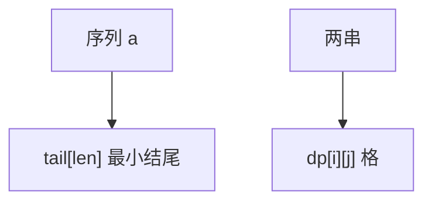

# LIS 与 LCS

最长上升子序列 $O(n\log n)$ 维护最小尾；最长公共子序列 $O(nm)$ 格图，可滚动数组。

<footer>—— 据 Fredman, On Computing the Length of Longest Increasing Subsequences, 1975；CLRS 第 15.4 节整理</footer>

上一课[换根 DP](/cs/rerooting-dp)在树上。序列回到数组。主干区间 DP 已警告 LCS 不是区间切点。缺口是 LIS 的耐心排序 / 最小尾，以及 LCS 的二维表。不重写树 DP。后课编辑距离是 LCS 的近亲。

## 问题

LIS：严格上升（或非降）最长子序列。$dp[i]=\max_{j\lt i,a_j\lt a_i} dp[j]+1$ 是 $O(n^2)$。维护数组 `tail[len]`：当前长度 `len` 的最小结尾。二分插入 $O(n\log n)$。Dilworth：LIS 长度 = 最少不升链划分（点名）。

LCS：两串 $A,B$，$dp[i][j]$ 来自左、上、或对角 $+1$。$\Theta(nm)$。公共子串连续，另一转移。

缺口是这两张表，不是编辑距离（下一课）。

### LIS 不是子数组

子序列可跳。连续上升是滑动或差分。不要用单调队列当 LIS。

Fredman 1975。CLRS 15.4 LCS。Hunt–Szymanski 结合相等对。后课 Hirschberg 线性空间 LCS/编辑距离。

## 方法

LIS：`tail` 二分。求方案需 `id` 与前驱。LCS：二维 DP，滚动 $O(\min(n,m))$ 空间若只要长度。

相等元素策略决定严格与否。

## 机制

`tail` 正确：同样长度更小的结尾对后续更宽松。LCS 最优子结构在前缀对。与状压：排列的 LIS 可 $O(n\log n)$ 不必 $2^n$。与生成函数无关。

## 边界

本课不写三维 LCS。不写近似 LCS。后课默认：LIS $O(n\log n)$；LCS $O(nm)$。下一课编辑距离与 Hirschberg。

## 小结

- LIS：最小尾 + 二分 $O(n\log n)$。
- LCS：前缀对 $O(nm)$。
- 子序列可跳，不是子数组。
- 出处：Fredman, 1975；CLRS 第 15.4 节。
