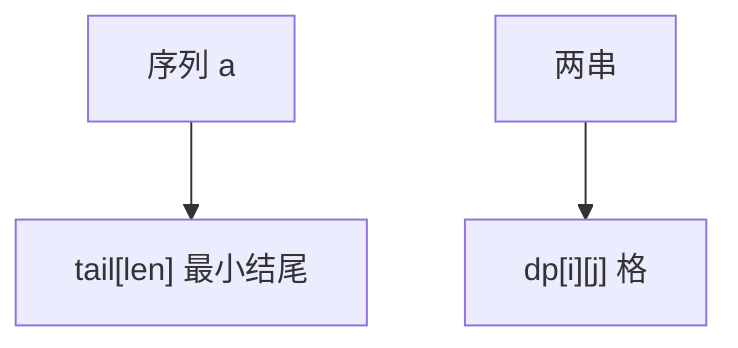
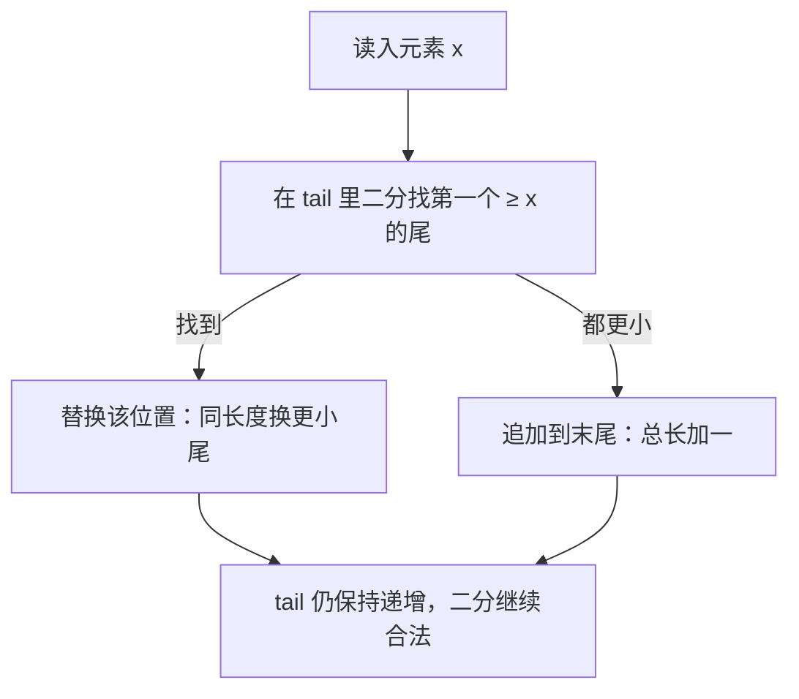

# LIS 与 LCS

最长上升子序列 $O(n\log n)$ 维护最小尾；最长公共子序列 $O(nm)$ 格图，可滚动数组。

<footer>—— 据 Fredman, On Computing the Length of Longest Increasing Subsequences, 1975；CLRS 第 15.4 节整理</footer>

上一课[换根 DP](/cs/rerooting-dp)在树上做无根化，现在回到数组上的序列。主干的区间 DP 课已警告过：LCS 不是区间切点问题。本课的缺口是两张表——LIS 的耐心排序与最小尾，LCS 的二维格；树 DP 不再重写。下一课编辑距离是 LCS 的近亲，先把格子在这里铺好。

## 问题

LIS 求严格上升（或非降）的最长子序列。逐元素转移 $dp[i]=\max_{j\lt i,a_j\lt a_i} dp[j]+1$ 是 $O(n^2)$：每个点回头看所有前驱。换一个状态才降得下去：维护数组 `tail[len]`，记录「长度为 len 的上升子序列目前见过的最小结尾」。同长度下结尾越小，后面能接上的元素越多，拿最小尾作代表不会更差。`tail` 随扫描保持递增，每来一个元素二分定位、替换或追加，$O(n\log n)$。Dilworth 定理从反面对照：LIS 的长度等于把序列划分成最少不升链的数目，本课点名不证明。

LCS 建在两串 $A,B$ 的前缀对上：$dp[i][j]$ 表示各自前缀的答案，末位不等时两者至少有一个用不上，取左、上较大者；相等才由对角 $+1$。$\Theta(nm)$ 个格子一个不省。公共子串要求连续，不等时归零，是另一套转移。缺口是这两张表，不是编辑距离（下一课）。

### LIS 不是子数组

子序列允许跳过元素，与要求连续的上升子数组是两道题：后者一次扫描或差分就够。别拿单调队列硬套 LIS——它维护的是滑动窗口最值，状态含义不同。

直觉类比：`tail` 像各长度组的「最小尾纪录榜」——同长度里结尾越小，后面越容易有元素接上。新元素要么刷新某一组的纪录（替换），要么开创更长的一组（追加），榜单始终只记每组最好的那个。

Fredman 1975。CLRS 15.4 LCS。Hunt–Szymanski 结合相等对。后课 Hirschberg 线性空间 LCS/编辑距离。

## 方法

LIS 扫一遍：每个元素在 `tail` 里二分找位置，替换则更新某长度的最小尾，越界则总长加一；求方案需另记 `id` 与前驱，结束时从最长处回跳。二分对严格上升取第一个 $\ge x$ 的尾，非降则改成第一个 $\gt x$。LCS 按行填二维表；只要长度时用滚动数组把空间压到 $O(\min(n,m))$。

```mermaid
flowchart TD
  A["序列 a"] --> TAIL["tail[len] 最小结尾"]
  AB["两串"] --> GRID["dp[i][j] 格"]
```

相等元素按上一段的口径处理，二分方向决定严格与否。

数字实例：扫 $[3, 1, 4, 1, 5]$：`tail` 依次为 $[3]$ → $[1]$ → $[1,4]$ → $[1,4]$（第二个 1 替换首位）→ $[1,4,5]$，最终长度 3，对应 LIS $1,4,5$。全程每元素只做一次二分加一次写。

## 机制

`tail` 的不变量是同长度存最小结尾：任何同长度的可行结尾都可以在不缩短的前提下换成它，长度答案因此不失真；长度越大结尾越大这条单调性让二分合法。LCS 的最优子结构落点在前缀对：末位的取舍只牵动最后一行一列，子问题互不纠缠。对照状压：排列求 LIS 若用 bitmask 记「用过哪些元素」要 $2^n$，而 `tail` 只依赖值的大小次序，$O(n\log n)$ 就够；它与生成函数无关，别往计数上想。

```mermaid
flowchart TD
  X["读入元素 x"] --> BS["在 tail 里二分找第一个 ≥ x 的尾"]
  BS -->|"找到"| REP["替换该位置：同长度换更小尾"]
  BS -->|"都更小"| APP["追加到末尾：总长加一"]
  REP --> INV["tail 仍保持递增，二分继续合法"]
  APP --> INV
```

## 边界

本课不写三维及以上的多串 LCS——格子数连乘，规模立刻爆炸；也不写近似 LCS。后课默认：LIS $O(n\log n)$；LCS $O(nm)$，引用时不再推导。下一课编辑距离与 Hirschberg。

常见误区：以为 LCS 的对角线顺出来就是最长公共子串。子序列允许跳字符，不等时取左、上较大者继续走；子串要求连续，不等必须归零重来——两套转移，答案可以差很远。

## 小结

- LIS：最小尾 + 二分 $O(n\log n)$。
- LCS：前缀对 $O(nm)$。
- 子序列可跳，不是子数组。
- 出处：Fredman, 1975；CLRS 第 15.4 节。
