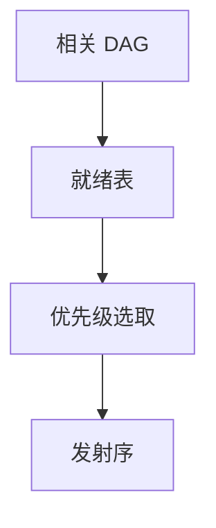

# 表调度

在数据相关 DAG 上维护就绪表，按优先级发下一条指令。块内表调度是后端调度的基线，不保证全局最优。

<footer>—— 据 Hennessy and Gross, 1983；Gibbons and Muchnick；龙书 8.10；对照主干[指令调度](/cs/instruction-sched) 整理</footer>

上一课[合并与拆分](/cs/coalescing-splitting)改了区间与可能的 `mov`。主干调度课已给 DAG。缺口是进阶：**优先级函数**（高度、延迟、寄存器压力）、分配前 vs 后调度、与线性扫描的交互。本课钉 list scheduling，软件流水下一课。

## 问题

选择后的指令有延迟。就绪队列：入度为 0。选谁：最长路径优先、或减压力。缺口是**启发式表**，不是再定义真相关。

分配后：物理寄存器引入反相关，可能要再调度。分配前：虚拟名，压力估计用「当前活着的名」。

### 表调度不是 Tomasulo

硬件动态调度运行时醒；本课静态排序。组成课超标量不替代编译器排 VLIW 槽。

Hennessy–Gross。龙书。Muchnick 8 章。本课块内；追踪调度点名 Fisher。

## 方法

建 DAG。拓扑：就绪表。循环发指令、更新。延迟槽目标插有效指令或 nop。

与展开：更大块更好调度。与向量化：向量指令延迟不同，表要认。

## 机制

最优调度难。表调度可能填不满。寄存器压力优先可能拉长关键路径。不要在有副作用的 store 上无视别名边。

调度与 fast-math 无关，但与 load 投机（移过分支）有关，须安全。

## 边界

本课不写整数线性规划最优调度。后课默认：块内用表调度。下一课软件流水：循环核的模调度。

也不把表调度当操作系统调度器。

## 小结

- 表调度：就绪表 + 优先级，块内排延迟。
- 分配前后各做一次是常见流水。
- 启发式，非最优。
- 出处：Hennessy and Gross, 1983；龙书；Muchnick。
