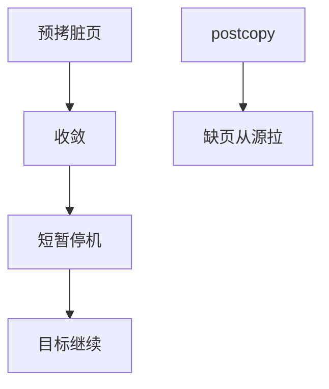

# 热迁移

热迁移迭代拷贝客户内存，再短暂停机拷剩余脏页与设备状态；postcopy 用 [userfaultfd](/cs/userfaultfd) 在目标上按缺页拉。 

<footer>—— 据 Clark et al., Live Migration of Virtual Machines, NSDI 2005；KVM 迁移文档</footer>

[气球](/cs/memory-balloon) 改变内存集合。[时钟](/cs/clock-virtualization) 必须在切瞬间对齐。缺口是 **live migration** 算法：预拷 vs 后拷。

## 问题

precopoy：循环拷脏，直到脏率可接受，downtime 拷 vCPU。postcopy：先切，缺页从源拉。缺口：设备状态、[SR-IOV](/cs/sriov-passthrough) 几乎不能迁；与 [NFS](/cs/nfs-semantics) 上的磁盘。本课不把 RDMA 迁移实现写完。

脏日志靠 EPT 写保护或 log dirty。对象是 VM 状态机，不是容器 runc 迁——容器后课。

## 方法

建目标 VM → 迭代内存 → 停 → 切网络 → 跑。对照 [fs 快照](/cs/fs-snapshots)：一个钉存储根，一个搬运行态。对照 sendfile：块在宿主之间，不是文件语义保证。对照 kexec：同机换核，不是跨机。

## 机制

热迁移把「机器」收成可复制的内存+设备检查点，使维护不停服务。收敛失败（脏太快）是经典坑。不要写成云产品 SLA。与 [dm-crypt](/cs/dm-crypt)：盘可共享存储，只迁 RAM。

安全：迁移通道要加密，否则内存明文在网上。

实现上：脏页率高于带宽则 precopy 永不收敛，要限 vCPU 或改 postcopy。磁盘必须是共享存储或一并拷。VF 直通要先解绑。 读法上只引用[上一课](/cs/memory-balloon)的结论，不把对象换成训练推理或限价簿。

本课在操作系统进阶的「虚拟化与隔离进阶 / Hypervisor」课序里，对象是 **热迁移**。

- 先修只引用，不重导：上一课的结论当公理，本课只补差。
- 五栏不吞并：不把本课写成大模型训练/推理，也不写成限价簿或权重量化。
- 文献用 OSTEP、McKusick、内核文档与具名会议论文；不发明 arXiv 编号。

## 边界

本课不引入所有 downtime 调参。不保证 GPU 直通可迁。下一课套娃：嵌套虚拟化。

版本字段会变，课序钉的是机制对象「热迁移」，不是某一主线内核的结构体名。
后课默认：VM 可迭代拷内存后切换。L1 上再跑 L2，下一课嵌套。

## 小结

- 预拷收敛脏页；postcopy 用缺页拉。
- 直通设备是迁移敌人。
- 嵌套虚拟化是下一课。
- 出处：Clark et al., NSDI 2005；KVM migration。
