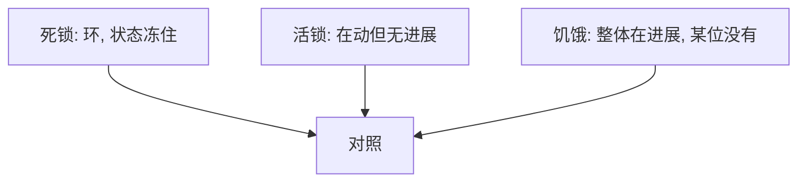

# 活锁与饥饿

活锁是大家都在变、却谁也做不成；饥饿是调度或锁策略永远不把资源分给某位等待者——两者都不是 Coffman 环。

<footer>—— 据 Silberschatz et al., Operating System Concepts；Tanenbaum MOS 整理</footer>

[上一课](/cs/banker-algorithm)用安全序列挡住走向死锁的分配。仍可能：协议互相「请对方先走」以至于无限重试，或低优先级/低权重永远选不上。缺口是把 **活锁**与**饥饿**从死锁里拆出来：图中无环，进度仍失败。[SJF](/cs/fcfs-sjf) 与[rwlock](/cs/rwlock) 已经点过饥饿，本课收成同步课的收口之一。

## 问题

死锁：等待集合永远不变。活锁：状态一直变（CAS 失败重来、以太网退避又碰撞、两人在走廊对让），没有人完成临界区。饥饿：系统整体有进度，某一个任务的等待无上界。缺口不是再跑银行家矩阵，而是**进度的粒度**：系统级、锁级、任务级。

无锁算法常保证无锁进度（有人能完成）而不保证无等待（每个人有限步完成）。后者失败可以是饥饿。

## 方法

活锁对策：随机退避、指定仲裁者、MCS 那种 FIFO 排队。饥饿对策：老化（等待越久优先级越高）、MLFQ 定期提升、写者优先 rwlock、CFS 的 vruntime 不让人的份额落到零。实时固定优先级**故意**允许低优先级饥饿，那是期限换来的。本课只对照，不改 RM 界限。

与[重启系统调用](/cs/restart-syscall)：无限 EINTR 循环若每次都失败，对应用也像活锁，那是信号政策。

## 机制

三种失败要不同工具：死锁查环或破条件；活锁改协议对称性；饥饿改公平或老化。银行家不管活锁：状态可以一直安全却没有人的请求被批准，若批准规则本身偏向某人。锁顺序下一课专管循环等待，不治饥饿。

## 边界

本课不把以太网 CSMA 的全部历史当 OS 正文，不讨论如何用活锁做拒绝服务。也不把优先级反转单列为第四种：它更接近「有界或无界延迟」，可与饥饿重叠。

后课默认：无环也可以没有进度。预防循环等待的工程手段是全局锁序，下一课锁顺序。

## 小结

- 活锁：在动无进展；饥饿：有人永远轮空；都不是死锁环。
- 对策分别是仲裁/FIFO 与老化/公平份额。
- 锁顺序破循环等待，下一课。
- 出处：Silberschatz et al., *OSC*；Tanenbaum and Bos, *MOS*。
