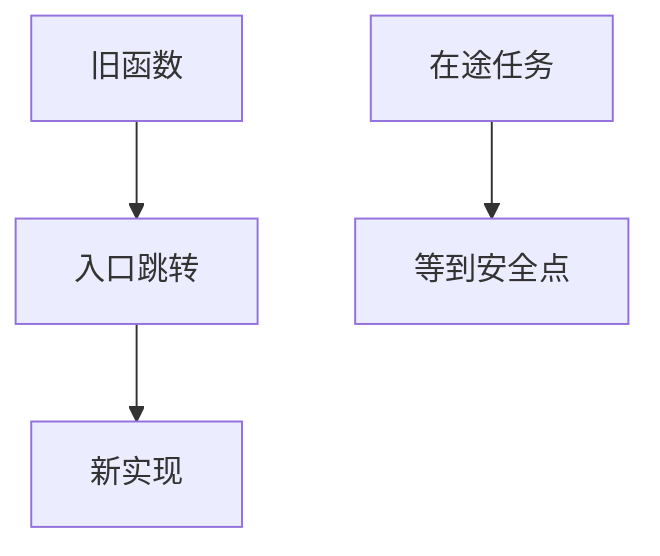

# livepatch

livepatch 把函数入口改成跳转到新实现，使安全修复不必重启；一致性模型决定何时所有任务都看见新函数。

<footer>—— 据 Linux livepatch 文档；[kprobes](/cs/kprobes-uprobes) 为改指令先修；kABI 后课</footer>

[oops](/cs/oops-panic) 的修复通常要重启。缺口是 **不停机打补丁**：ftrace 或 jmp，过渡态。

## 问题

替换 `foo` → 新 `foo`。旧栈上的任务仍在旧函数。缺口：可靠性模型（等待安全点）；与 CFI；不能改数据结构布局——那是 kABI。本课不把厂商补丁流程写成运维手册。

KGraft/kpatch 历史不同模型。对象是函数级替换，不是容器滚动发布。

## 方法

加载模块 → 注册替换表 → 启用。对照 kprobe：临时 vs 持久替换。对照 [FUSE](/cs/fuse)：用户升级守护即可；内核不行。对照 Secure Boot：模块仍要签名——后课。

## 机制

livepatch 用指令替换换重启窗口，服务高可用。它不能魔法般迁移堆上的结构体。不要写成零风险。与 [sched_ext](/cs/sched-ext)：BPF 程序可卸载；livepatch 更敏感。

失败的补丁比漏洞更糟，要回滚路径。

实现上：一致性模型若等所有任务离开旧函数，持锁睡眠的任务会挡住打补丁。只能替换函数，不能改结构体布局。签名与 kABI 约束和普通模块相同。 读法上只引用[上一课](/cs/oops-panic)的结论，不把对象换成训练推理或限价簿。

本课在操作系统进阶的「安全、启动与调试 / 观测与调试」课序里，对象是 **livepatch**。

- 先修只引用，不重导：上一课的结论当公理，本课只补差。
- 五栏不吞并：不把本课写成大模型训练/推理，也不写成限价簿或权重量化。
- 文献用 OSTEP、McKusick、内核文档与具名会议论文；不发明 arXiv 编号。

## 边界

本课不引入所有 arch 的 ftrace 调用约定。不保证实时系统的安全点延迟。下一课如何得到可加载的内核：配置与编译。

版本字段会变，课序钉的是机制对象「livepatch」，不是某一主线内核的结构体名。
后课默认：函数可在运行时替换。内核配置与构建，下一课。

## 小结

- livepatch 跳转到新函数，等待一致性。
- 不改变数据结构布局。
- 内核配置编译是下一课。
- 出处：Linux livepatch；kpatch 背景。
