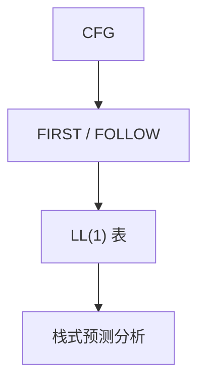

# LL 与 FIRST/FOLLOW

FIRST 回答「这条产生式能以哪些记号开头」；FOLLOW 回答「这个非终结符后面能跟什么」。二者填满预测表。

<footer>—— 据龙书第 4 章整理</footer>

上一课[递归下降](/cs/recursive-descent)已经用手写预测。本课不重写每个 `parseA`。缺口是：把预测做成**表**，并给出何时一个记号恰好对应一条产生式——LL(1)。FIRST/FOLLOW 是填表算法，不是另一套语言。

## 问题

手写下降在分支多时易漏冲突。LL(1)：对每个 $A$ 与前瞻记号 $a$，至多一条产生式。FIRST($\alpha)$：$\alpha$ 能推出的开头终结符；若 $\alpha\Rightarrow^*\varepsilon$，再看 FOLLOW($A$)。冲突：同一格两条产生式，或 FIRST 相交。缺口是计算这两个集合，而不是再定义 CFG。

左递归与公共前缀常导致非 LL(1)。提取与改写仍要，本课把冲突显示在表上。

### FOLLOW 不是 FIRST 的别名

FIRST 看右部能长出什么头。FOLLOW 看 $A$ 在哪些产生式里出现在中间，后面兄弟的 FIRST，以及父亲的 FOLLOW。$\varepsilon$ 产生式全靠 FOLLOW 填表。搞混则可选结构全错。

龙书 4.4 节给 FIRST/FOLLOW 的不动点迭代。LL($k$) 用 $k$ 个记号，本课 $k=1$。表驱动分析栈代替递归调用栈，与下降等价。

## 方法

迭代求 FIRST：终结符、$\varepsilon$、再传播。FOLLOW：从开始符号的 `$` 起，按产生式传播。填 $M[A,a]$。分析：栈底 `$`、顶 $S$，与输入比；终结符匹配弹出，非终结符查表展开。

若表有冲突，语言不是 LL(1)，改文法或换 LR。开始符号的结束符 `$` 必须进 FOLLOW，否则文件末尾无法接受。

## 机制

递归下降是 LL(1) 表的递归写法；表驱动是显式栈。错误：查表空则非法。同步记号可用 FOLLOW 当恢复点，本课点名。表达式用 LL 常要左因子与优先级分层，文法变丑——这是后课 LR 的动机之一。

## 边界

本课不移进归约，不造项集。不算 LL(2)。不处理二义文法的优先级声明（那是 Yacc/LR 的习惯）。后课默认：LL(1) = FIRST/FOLLOW 无冲突的预测表。更强的自底向上分析是 LR。

## 小结

- FIRST 管产生式开头；FOLLOW 管可空之后。
- LL(1) 表每格至多一条；冲突则非 LL(1)。
- 表驱动与递归下降同一预测。
- 冲突就改文法或改用 LR，不要靠回溯。
- 出处：Aho et al., 龙书第 4 章。
