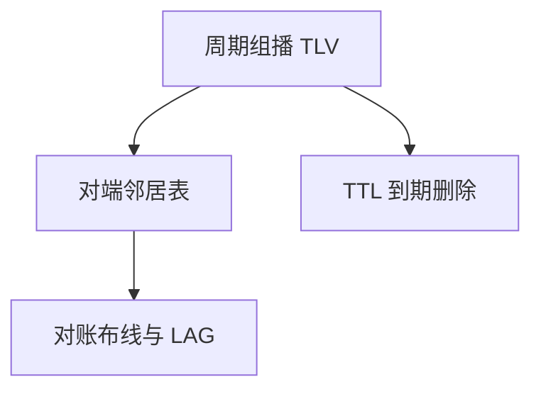

# LLDP

邻机用 TLV 说出自己的机箱、口名与能力；链路层发现不转发业务，只填一张谁连着谁的图。

<footer>—— 据 IEEE 802.1AB LLDP；TIA-1057 LLDP-MED 整理</footer>

[上一课](/cs/lacp)把多口收成逻辑边，运维仍可能插错线。缺口是**邻居发现**：LLDP 在链路上组播自己的 chassis ID、port ID、TTL，对端写入 MIB。本课不把 RSTP 握手写完。

## 问题

ARP 与 ICMP 发现的是三层可达。插错 VLAN、插错 LACP 成员，需要二层「你是谁」。LLDP：目的 MAC 是 01-80-C2-00-00-0E，桥不转发（与某些厂商 CDP 行为对照）。TLV 可带管理地址、IEEE 802.3 能力、MED 给话机供电与 VLAN。TTL 到期则表项消失——邻居离开不必显式再见。

不要把 LLDP 当认证：未加密，可伪造，只是运维平面。

802.1AB 定义 PDU 与 MIB。CDP 是 Cisco 对照，本课不展开。本课不把 802.1X 证书当 LLDP 的一部分。

### 发现不是认证

明文 TLV 服务布线对账，可伪造。桥不转发该组播。邻居 TTL 老化，不必显式再见。不改转发拓扑。

## 方法

每口周期发 LLDP 帧；收则刷新。画：口 → 邻居表（系统名、口描述）。与自协商对照：协商选速率，LLDP 选「人读得懂的名字」。LACP 成员口上 LLDP 仍按物理口报告，便于查捆错。

方法止于选定对象与对照；机制才说它如何嵌入已有分层与主干课。

## 机制

生成树 BPDU 也是链路组播，但目的是算树；LLDP 不改转发拓扑。两者可同口并存。交换机架构后课的控制面 CPU 处理这些慢协议，数据面不查 LLDP。

MED：话机告诉交换机 PoE 与语音 VLAN，仍是 TLV，不是呼叫信令。

## 边界

本课不引入 sFlow 采样。RSTP/MSTP 是下一课。后课默认：LLDP 提供一跳身份，不提供可达性证明。

关闭 LLDP 的安全理由是减少侦察；那是权衡，不是协议缺陷清单。

上一课留下的缺口在本课收口；「LLDP」进入后课词汇表后只引用。文献用来钉对象与边界，不把本课写成该主题的独立综述。下一课[RSTP / MSTP](/cs/rstp-mstp)。

## 小结

- LLDP 用不可转发组播交换一跳身份。
- TTL 老化邻居；不替代 STP 或 LACP。
- 明文、可伪造，服务运维。
- 后课只引用本课钉死的对象，不从该领域总问题重开。
- 出处：IEEE 802.1AB；LLDP-MED。
