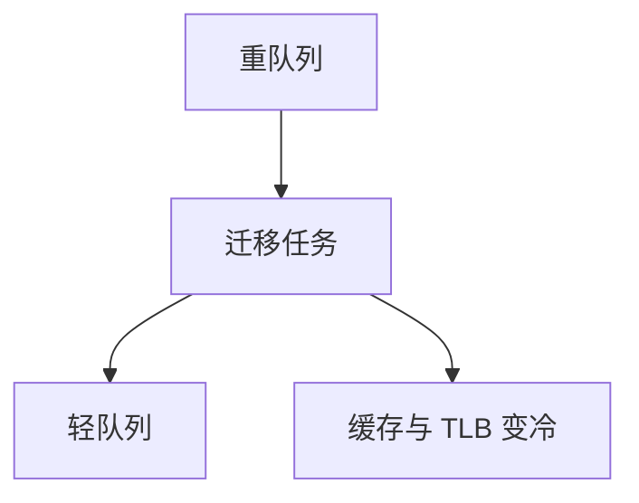

# 负载均衡与迁移

每 CPU 一条运行队列之后，必须有人把过重的核上的任务搬到过轻的核上；搬迁付缓存与 TLB 的税。

<footer>—— 据 Love, Linux Kernel Development；Silberschatz et al. 对多处理器调度的整理</footer>

[上一课](/cs/nice-weight)让单队列里的权重有意义。多核上[运行队列](/cs/runqueue)是 per-CPU 的：若所有可运行任务挤在 CPU0，其余核跑 idle，份额再精致也没用。缺口是**负载均衡**：比较各队列负载（可运行权重和），把任务迁移到别的核。本课钉何时搬、搬的代价，不写 NUMA 距离表。

## 问题

唤醒时入哪条队列：上一唤醒者所在核（缓存热）还是当前最闲核（立刻有 CPU）？周期性平衡：偷或推任务。迁移必须改 PCB 的 CPU 字段、从旧队列摘下、在新队列按 vruntime 调整——两核之间的 min_vruntime 不同，要折算，否则刚迁入的人会饿死或垄断。缺口不是 nice 表，而是**跨队列的一致性**。

亲和掩码可以禁止迁到某些核。硬亲和下一课才展开；本课承认掩码是迁移的约束。

## 方法

触发：新任务、任务唤醒、核变 idle、定时 tick。比较负载；若不平衡超过阈值，选一个可迁任务（最好缓存冷、不在运行）。IPI 踢目标核重新调度。idle 平衡更积极：与其空转，不如付一次迁移税。

与[上下文切换](/cs/context-switch) 的差别：切换可在同核；迁移是换核，页表根若同进程可不换，但 cache 几乎必冷。

## 机制

平衡让 vruntime 公平从单核近似变成全机近似：长期看，任务在各核上分到的时间还受「当时在哪条队列」影响。迁得太勤，吞吐掉进 cache miss；迁得太懒，有核 idle。这是[调度指标](/cs/scheduling-metrics)里利用率与吞吐的多核版，不是新尺子。

实时任务通常不参与公平偷任务，或单独规则，以免期限被搬到忙核。

## 边界

本课不把调度域拓扑（SMT / 核 / 包）的全部层次写成手册，不讨论工作窃取的每一种启发式。NUMA 上「闲但远端」可能比「稍忙但本地」更差，那是再后一课。硬件中断亲和已经讲过，与任务迁移是一对。

后课默认：分时多核靠迁移摊负载。期限任务不能靠摊份额，下一课[实时调度对照](/cs/realtime-sched)已经换尺子，其后展开 RM。

## 小结

- per-CPU 队列必须迁移，否则有核闲、有核挤。
- 迁移折算 vruntime，并付缓存税。
- 实时对照与 RM 是下一课序。
- 出处：Love, *LKD*；Silberschatz et al., *OSC*。
