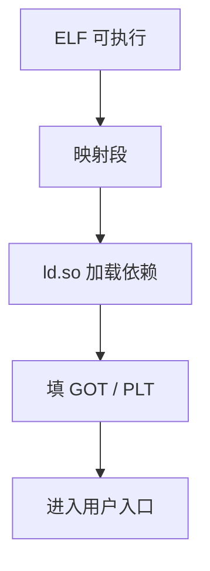

# 加载与动态链接

可执行文件进内存时，加载器映射节并可能再跑一遍重定位；共享库通过 GOT/PLT 把符号绑定推迟到加载或首次调用。

<footer>—— 据 Levine, Linkers and Loaders, 2000；ELF 与 System V ABI 整理</footer>

上一课[GOT 与 PLT](/cs/got-plt)把静态符号填成地址。许多程序还依赖共享库：`libc` 不进每个可执行文件。本课不重做 `ld` 的节合并。缺口是：**加载**（把文件变成进程里的映像）与**动态链接**（运行时解析）。进程映像的操作系统细节下一课程才展开；本课从编译产物一侧讲 GOT/PLT。

## 问题

静态链接体积大、修 bug 要重链所有程序。动态：可执行文件带着对 `printf` 的未决引用。加载时：内核（或用户加载器）按 ELF 程序头 `mmap` 各段，解释器（`ld.so`）登场，把依赖库映射进地址空间，填 GOT。延迟绑定：PLT 桩第一次跳进解析器，再改 GOT，其后直跳。

[虚拟内存分页](/cs/paging-vm)让不同进程共享库的只读页；本课只要「映射 + 再重定位」，不写缺页。

### 动态不是「不链接」

仍要解析符号，只是时刻从编译期挪到加载/首次调用。ABI 仍必须一致：库与可执行文件同一份 psABI，否则参数寄存器错位。

Levine《Linkers and Loaders》给 GOT/PLT 图。ELF `DT_NEEDED`、`R_*_JUMP_SLOT` 是机制名字。本课不写动态节全部标签。

## 方法

执行：内核读入口，若有 `PT_INTERP` 则先跑动态链接器。链接器：广度加载依赖、重定位相对型、处理 `BIND_NOW` 或懒绑定。然后跳到用户入口（CRT 再调 `main`）。

[ABI 代码生成](/cs/abi-codegen)发出的对外部符号的访问应是 PIC 友好的（`auipc`+GOT 等），否则共享库无法任意加载地址。

## 机制

PIC：代码不假定自己的绝对加载址，用相对或 GOT。文本段可共享。写 GOT 使数据页私有（写时复制，OS 课再钉）。符号可见性（default/hidden）影响能否被插桩，点名。

## 边界

本课不写内核 `execve` 全部、不写容器命名空间。不把动态链接当安全课的 RELRO 清单——可点 ASLR 要 PIC，细节在安全栏。运行时堆与垃圾回收是下一课：加载完成后程序还要分配对象。

后课默认：进程启动可以经 `ld.so`；外部 C 符号可懒绑定。运行时与 GC 直觉接在可执行映像已经在内存之后。

## 小结

- 加载映射 ELF 段；动态链接器解析共享库。
- GOT/PLT 把绑定推迟；PIC 使库可装到任意址。
- ABI 必须与库一致。
- 出处：Levine, *Linkers and Loaders*, 2000；ELF；System V / RISC-V psABI。
