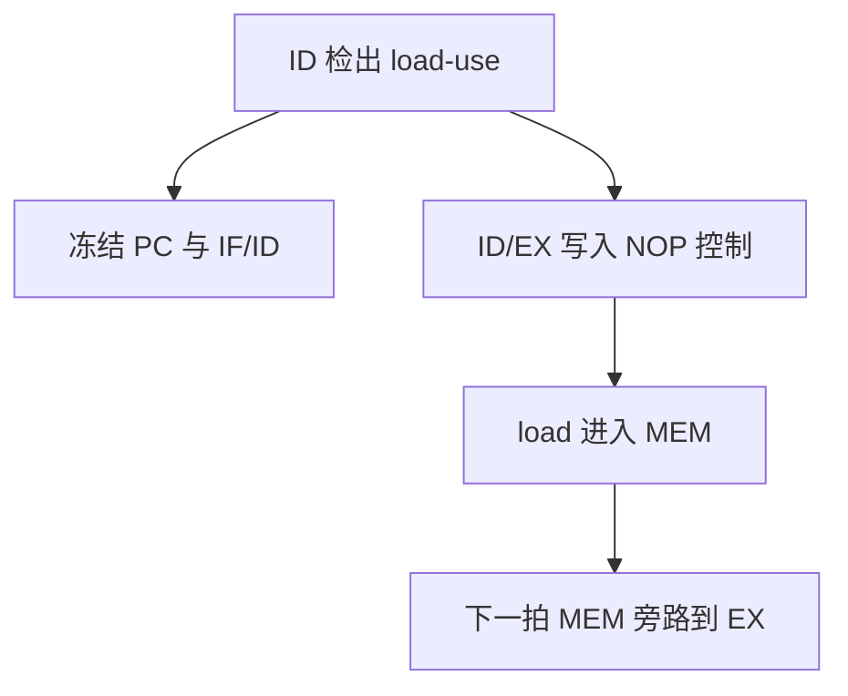

# load-use 气泡

load 的数据在 MEM 结束才出现；紧接着的 ALU 若已进入 EX，旁路也晚了一拍，只能插入气泡。

<footer>—— 据 Patterson and Hennessy, Computer Organization and Design (RISC-V)；Hennessy and Patterson, CA:AQA 整理</footer>

[上一课](/cs/data-hazard-forward)用 EX/MEM 与 MEM/WB 旁路恢复了 ALU 对 ALU 的 RAW，并已经点名 load-use 要停一拍。本课不重画 mux。缺口是：那一拍气泡究竟冻哪几级、控制位如何变成 NOP，以及编译器调度为什么只能减少它、不能代替硬件检测。本课只把 load-use 停顿写成流水线控制。

## 问题

`lw x1, 0(x2)` 后紧跟 `add x3, x1, x4`。转发源在 MEM 末，使用者在下一拍的 EX 开头就要 ALU 输入。路径差一拍，旁路接不上。缺口不是再加一条从 MEM 到 EX 的导线——数据那时还不存在——而是**在 ID 认出「前一条是 load 且 `rd` 命中本条 `rs`」时，让 IF/ID 保持，并向 ID/EX 写入空操作**。

上一课把这条规则附在转发课里，容易让人以为停顿是转发失败的边角。五级整数核里，它是数据通路上唯一必须靠气泡的 RAW。

早期 MIPS 把 load 延迟暴露给软件：延迟槽里不得使用刚 load 的寄存器。当代核用硬件互锁，ISA 不再要求程序员填槽。

## 方法

检测：ID/EX 的 `MemRead` 为真，且其 `rd` 等于 ID 级指令的 `rs1` 或 `rs2`。成立则：PC 与 IF/ID 写使能关掉（取指与译码冻结），ID/EX 控制位清零（EX/MEM/WB 变成不写堆、不访存）。下一拍 load 进入 MEM，再下一拍走上一课的 MEM→EX 转发。

编译器可在 load 与使用者之间插入无关指令，使检测不触发。硬件仍必须对任意指令对正确；调度只改频率，不改语义。

## 机制

气泡占用一拍发射机会，CPI 加在数据停顿项上。与结构冒险的停顿同类：流水线寄存器被写成「什么也不做」，但对象是数据相关而不是端口不够。写回相（前半拍写堆）救不了 load-use：值根本还不在堆里。

多发射后，同一拍里可能有一条 load 和一条使用它的 ALU，窗口更大，停顿规则要按发射包重写。本课钉五级单发射：至多一拍。

## 边界

本课不处理分支条件也依赖 load 的情况——那是控制冒险与数据冒险叠在一起，后课预测器仍要等操作数或把比较前移。也不引入缺失下继续：这里假定 MEM 一拍完成；cache 缺失会把这一拍变成许多拍，那是存储器层次的缺口。

后课默认：整数 ALU 相关用转发；load 后立即使用插入一拍气泡。谈到控制流，下一 PC 才是新缺口。

## 小结

- 转发消除 ALU–ALU RAW；load-use 差一拍，必须互锁。
- 冻结取指/译码，向 EX 插入 NOP 控制，再走 MEM 旁路。
- 编译调度只降频率；硬件检测不能省。
- 出处：Patterson and Hennessy, *COD* RISC-V load-use hazard；Hennessy and Patterson, *CA:AQA*。
