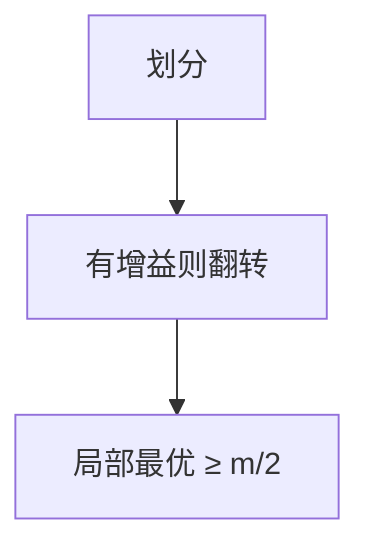

# 局部搜索与最大割

翻转一个顶点若能增加割边则翻，局部最优至少一半边；Goemans–Williamson SDP 到 $0.878$。

<footer>—— 据 Sahni and Gonzalez；Goemans and Williamson, Improved Approximation Algorithms for Maximum Cut, 1995；CLRS 第 35 章整理</footer>

上一课[背包 FPTAS](/cs/knapsack-fptas)是缩放 DP。最大割 NPC。缺口是局部搜索 2-近似（无向无权：割 $\ge m/2$）以及 SDP 点名。不重写 LP 舍入框架。后课模拟退火把局部搜索加热。

## 问题

划分 $V=S\cup T$，割为跨边。翻转 $v$ 若内部边少于跨边则增益正。局部最优：每人的跨边 $\ge$ 内部，对边求和得 $2\mathrm{ALG}\ge m$，故 $\mathrm{ALG}\ge m/2\ge\mathrm{OPT}/2$。加权同样可局部。

GW：半定松弛 + 随机超平面，$0.878$。本课认结论，不写 SDP 求解。

缺口是翻转，不是 Karger（那是最小割）。

### 局部最优不是全局

可卡在 $1/2$。要更好用 SDP 或其它。不要无限翻转当多项式：每次增益至少 1（整数权）则多项式。

Goemans–Williamson 1995。局部搜索 2-近似是教材。后课模拟退火逃局部最优，无最坏比保证。

## 方法

任意划分。循环扫描可改进的翻转直到停。随机初始化可多起点。

加权注意终止与精度。

## 机制

握手：每点局部条件求和。每条割边计两次点贡献。与最大流最小割：最大割是另一目标，不能最小割算法直接翻。与 GW：几何舍入超平面。

## 边界

本课不证 $0.878$ 与 Unique Games。不写最大有向割。后课默认：Max-Cut 局部搜索 $1/2$；SDP 更好。下一课模拟退火。

## 小结

- 翻转局部最优 $\ge m/2$。
- 整数增益则多项式终止。
- SDP $0.878$ 点名。
- 出处：Goemans and Williamson, 1995；CLRS。
