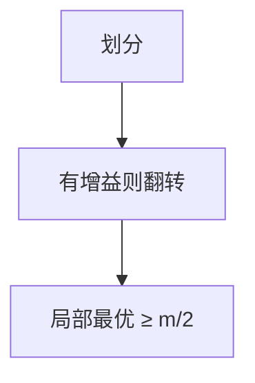

# 局部搜索与最大割

翻转一个顶点若能增加割边则翻，局部最优至少一半边；Goemans–Williamson SDP 到 $0.878$。

<footer>—— 据 Sahni and Gonzalez；Goemans and Williamson, Improved Approximation Algorithms for Maximum Cut, 1995；CLRS 第 35 章整理</footer>

上一课[背包 FPTAS](/cs/knapsack-fptas)用缩放 DP 换近似。最大割 NP 难，开头却便宜得惊人：随便切一刀再局部翻修就是 2-近似。缺口是这条局部搜索路线——为什么没人能再赚的划分至少切中一半边——以及 SDP 点名。不重写 LP 舍入框架；后课模拟退火加热。

## 问题

把顶点划成 $S\cup T$，割边是横跨两侧的边，目标最大化割边数。翻转顶点 $v$ 的增益是新增跨边减去失去的：若 $v$ 的内部邻居多于跨侧邻居，翻它必赚。没有翻转能赚时算法停下，此时每个顶点的跨侧邻居 $\ge$ 内部邻居；对顶点求和，每条边都在两个端点的账上各计一次，得 $2\cdot\mathrm{ALG}\ge 2(m-\mathrm{ALG})$，即 $\mathrm{ALG}\ge m/2\ge\mathrm{OPT}/2$——无权无向情形的 2-近似。加权版同样成立，计数换求和即可。

GW：半定松弛 + 随机超平面舍入，$0.878$。本课认结论，不写 SDP 求解。

缺口是翻转，不是 Karger（那是最小割）。

### 局部最优不是全局

局部最优可能离全局很远，$1/2$ 这条保证是紧的——存在实例任何单点翻转都无增益、割却只有约一半；要超越得换松弛（SDP 或其它）。终止性也别想当然：每次增益至少 $1$（如整数权）时，总增益以 $m$ 为上界、翻转才多项式步终止；实数权可能翻个不停。

Goemans–Williamson 1995。局部搜索 2-近似是教材。后课模拟退火逃局部最优，无最坏比保证。

## 方法

从任意划分起步，循环扫描顶点，增益为正就翻，直到一整轮无翻转发生。随机初始化、多起点重启只在常数上捡便宜，不改最坏比。

```mermaid
flowchart TD
  CUT["划分"] --> FLIP["有增益则翻转"]
  FLIP --> LOC["局部最优 ≥ m/2"]
```

加权时先看权的量级：整数权天然保证终止；浮点权要设阈值，阈值又可能吃掉近似比。

## 机制

证明的形状值得记住：局部最优性按点给出不等式，握手求和把它抬成全局下界，$1/2$ 从割边与非割边的对称计数里掉出来。此形状在局部搜索证明里常见。与最大流最小割区分：名字像、目标相反——最小割求切断代价最小的一刀，最大割求跨越最多的一刀，前者的多项式算法帮不上后者。GW 的 $0.878$ 来自几何舍入：顶点嵌入单位球面，随机超平面切两半，一条边被割中的概率随两端点夹角增大，期望割值 $\ge 0.878\cdot\mathrm{OPT}$。

## 边界

本课不证 $0.878$，不进入 Unique Games 最优性讨论；最大有向割不写（常数不同）。后课默认：Max-Cut 局部搜索基线 $1/2$，SDP 更好。下一课模拟退火。

## 小结

- 翻转局部最优 $\ge m/2$。
- 整数增益则多项式终止。
- SDP $0.878$ 点名。
- 出处：Goemans and Williamson, 1995；CLRS。
