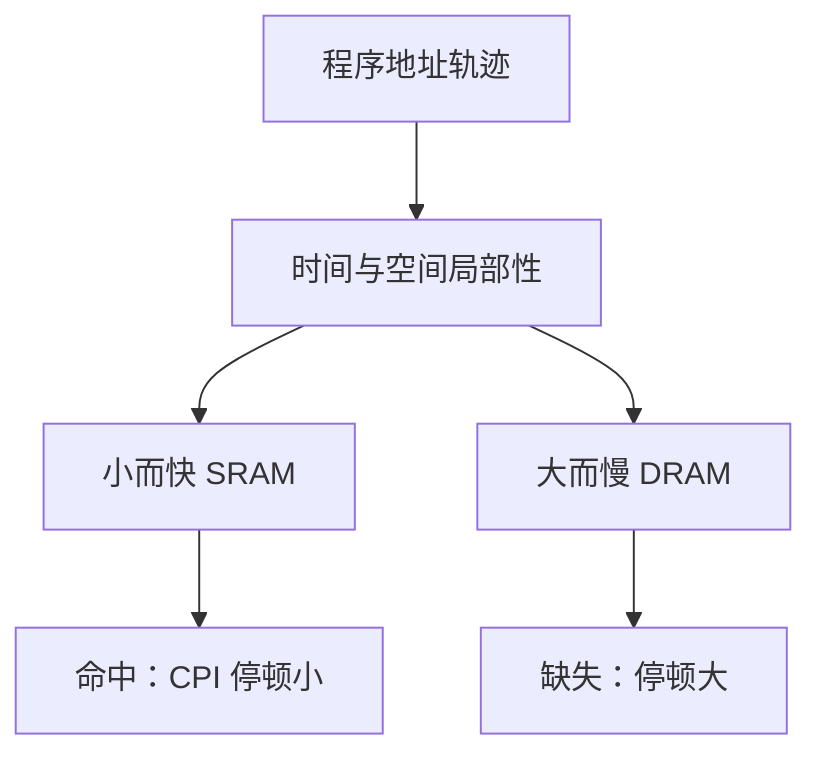

# 局部性原理

程序在短时间内只用地址空间的一小块；没有这条经验规律，SRAM 与 DRAM 之间的速度差就无法被藏住。

<footer>—— 据 Denning, The Working Set Model for Program Behavior, CACM 1968；Hennessy and Patterson, CA:AQA 整理</footer>

[上一课](/cs/ipc-util)把 CPU 时间写成指令数 × CPI × 周期，停顿可以任意加项。五级核假定 MEM 级一拍完成访存。[SRAM 与 DRAM 阵列](/cs/memory-array-sram-dram)已经说明：大容量用 DRAM，随机访问要许多纳秒，SRAM 快但贵、小。本课不重讲电容刷新，也不从「存储器是什么」另起。缺口是：若每次 load 都付 DRAM 延迟，CPI 里的停顿项会淹没流水线的全部收益。本课只钉时间局部性与空间局部性，作为后课 cache 的前提。

## 问题

流水线把计算叠起来以后，瓶颈从 ALU 挪到访存。DRAM 做不到每拍随机读。[渐近记号](/cs/asymptotic-notation)描述的是步数，不描述哪一次访问碰巧挨着上一次。缺口不是新的器件，而是**程序的地址轨迹不是均匀撒在整个空间上**。

时间局部性：刚用过的地址很快再用。空间局部性：刚用过的地址附近很快被用。循环扫数组、顺序取指，都是这两条的实例。本课不引入 cache 行、不引入页。

Denning 的工作集是「最近 $T$ 时间内触到的页集合」。本课先用局部性一词，工作集的定量在虚拟内存课再引用。

## 方法

把访存看成地址序列 $a_1,a_2,\ldots$。时间局部性说：若 $a_t=x$，则近期内 $x$ 再次出现的概率远高于均匀随机。空间局部性说：$x$ 附近的字（同一块、同一页）也会在近期出现。层次存储器的策略因此是：把最近用过的块放进小而快的 SRAM，命中则延迟接近寄存器，缺失才付 DRAM。

本课只承认这条经验规律可被利用；块多大、怎么映射，是[直接映射 Cache](/cs/direct-mapped-cache)的缺口。

## 机制

有了局部性，平均访存时间可以写成命中时间 + 缺失率 × 缺失代价，再进 CPI 公式。没有局部性，缺失率接近 1，层次没有意义。取指天然有空间局部性；数据是否有，取决于布局——后课链表会把它打断。

局部性是程序性质，不是硬件保证。编译器改循环顺序、程序员改数据结构，都会改轨迹。硬件只能赌「多数程序像这样」。

## 边界

本课不讨论 cache 一致性，不引入 TLB，不把局部性说成数学定理。反例存在：大步长跳扫、指针追逐，空间局部性很差。后课会在链表、稀疏图里回到这条边界。

也不要把局部性写成「cache 的定义」。cache 是实现；局部性是为什么实现能赢。后课默认：谈到存储器层次，先假定程序有可用的时间与空间局部性。

## 小结

- DRAM 延迟会毁流水线收益；局部性让小 SRAM 接住大多数访问。
- 时间：再用同一地址；空间：用邻近地址。
- 映射、写策略、缺失分类都是后课的缺口。
- 出处：Denning, *CACM* 1968；Hennessy and Patterson, *CA:AQA* 存储器层次。
