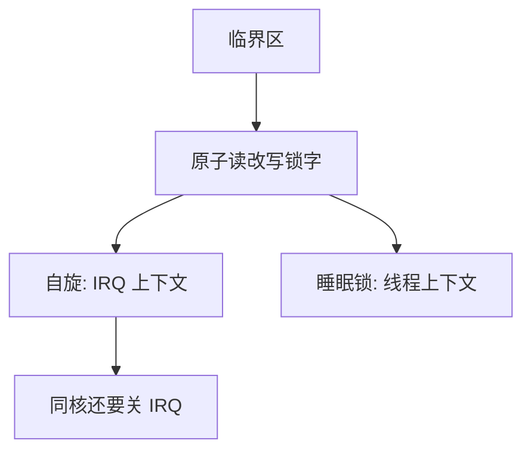

# 锁与关中断

互斥要用硬件提供的原子能力；在单处理器上，关中断曾经是最短的临界区实现。

<footer>—— 据 Dijkstra, Solution of a problem in concurrent programming control, CACM 1965；Tanenbaum MOS 整理</footer>

[上一课](/cs/atomic-rmw)要互斥，还没有手段。[中断下半部](/cs/interrupt-bottom-half)与线程调度都会插入临界区中间。缺口是：如何保证「读—改—写锁字」本身不被切开，以及内核里能否用关中断代替锁。本课给出锁与 IRQ 的搭配，不把信号量计数写完。

## 问题

软件若只用普通存取去做锁（Peterson 在顺序一致下可以），现代多核的弱内存与编译器重排会把它拆掉。硬件提供原子交换或比较并交换，把「尝试获得」收成一条。单核内核里，关中断能阻止下半部抢同一结构；多核上关本地中断挡不住另一 CPU。缺口是分清：**谁与谁并发**。

本课不写每种体系结构的 `lock` 前缀，只要求存在原子读改写。

自旋锁忙等，持有期间不能睡。可睡眠锁（互斥锁）在拿不到时走切换。IRQ 上下文只能自旋，因为 ISR 不能调度。

## 方法

用户态：用原子指令做自旋或 futex 式睡眠锁。内核：访问「线程与 ISR 共享」的队列时，自旋并关本地 IRQ（或用关底半部），避免锁持有者被同核下半部再抢同一把锁死等。多核仍需自旋，因为关自己的中断不影响对方核。

Dijkstra 1965 证明用户进程可以在无特殊「锁总线」的机器上互斥；当代实现把那条证明换成硬件原子与内存屏障。本课取后者为默认，前者当历史对照。

## 机制

锁把临界区变成可移植的括号。关中断是更粗的括号：它推迟所有 IRQ，延迟上升，只能罩住极短内核路径。持锁过长会损坏[调度指标](/cs/scheduling-metrics)里的响应，也会在实时对照里造成优先级反转：低优先级持锁，高优先级忙等。本课点名，完整协议（优先级继承）不展开。

## 边界

本课不引入读写锁与 RCU 的全部规则，不把死锁四个条件提前写完。也不给原子指令的微架构延迟表。用户态关中断是不允许的：那是特权。

读—拷贝—更新等读多写少路径是后话；本课默认写者互斥。

后课默认：互斥可用原子锁实现；内核共享 IRQ 数据时要关中断或等价屏蔽。需要「计数与等待条件」，下一课信号量。

## 小结

- 锁靠硬件原子；单核关中断只能挡同核 IRQ，挡不住多核。
- ISR 不能拿睡眠锁。
- 计数式等待是信号量的缺口。
- 出处：Dijkstra, *CACM* 1965；Tanenbaum and Bos, *MOS*；Silberschatz et al., *OSC*。
