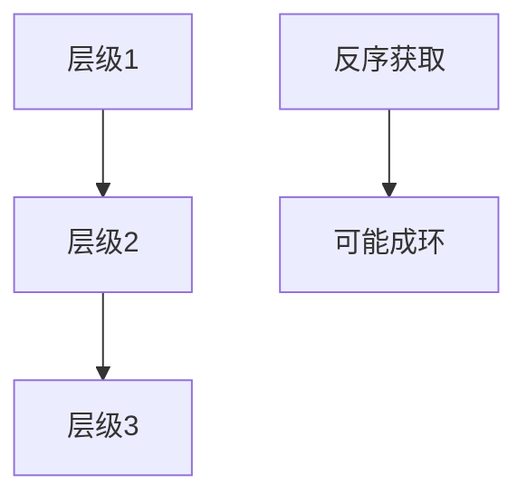

# 锁顺序

对所有锁规定一个全序，任何路径只能按升序获取：循环等待被静态拆掉，这是内核里最常用的死锁预防。

<footer>—— 据 Silberschatz et al., Operating System Concepts；Love, LKD 对锁层级的整理</footer>

[上一课](/cs/livelock-starvation)把活锁与饥饿从环上拆走。[预防与避免](/cs/deadlock-prevent)点过锁排序。[Coffman](/cs/deadlock-coffman) 的第四条是循环等待。缺口是把工程纪律写死：**锁顺序**——每把锁一个层级号，获取时号必须上升；需要反序则先放掉已持有的。本课收同步课主干，不进入地址空间布局。

## 问题

两把 mutex 在不同文件里各看起来正确，组合出 AB-BA。银行家要配额，检测有滞后。排序：规定 `lock_A` 先于 `lock_B`，所有调用方遵守，则等待图不可能出现 A←B←A。缺口不是再定义四条件，而是这份**全序与校验**（运行时锁依赖图、注释里的层级）。

同层多把锁（多对象）还要规定二级序：例如按地址从低到高拿，以免两个对象之间成环。

## 方法

给锁分类：调度队列锁、内存描述符锁、inode 锁……文档写层级。获取：只能向上。不得不向下：释放到分叉点再按序重拿，可能需要重试（注意与活锁：重试要有进展或退避）。IRQ 上下文只允许某层以上的自旋，与[锁与关中断](/cs/lock-irq) 一致。锁依赖检测：记录当前任务持有的锁，新获取若与已持有的历史边成环则报警。

与 RCU：读侧无锁，不进这张序；写者仍要遵守保护该结构的互斥锁序。

## 机制

锁顺序把预防做成可审查的规范，适合内核这种长期演进的代码。它不解决饥饿，不解决活锁，也不自动给出 PI。违反序是缺陷，即使测试没撞上死锁。用户程序同样可用：对全局锁集合编号。动态创建的锁用地址序当全序的一种。

## 边界

本课不把 Linux `lockdep` 的全部类写成调试手册，不讨论如何故意构造死锁。虚存布局、brk、缺页是下一课程单元；页表锁也要进全局序，但对象换成分页。同步课到此结束。

后课默认：多锁必须有全序。用户地址空间里代码、堆、栈如何摆，下一课[地址空间布局](/cs/addrspace-layout)。

## 小结

- 锁全序破坏循环等待，是内核主要的死锁预防。
- 同层对象按地址等二级序；反序必须先释放。
- 不处理饥饿与活锁；下一单元进入虚存布局。
- 出处：Silberschatz et al., *OSC*；Love, *LKD*。
