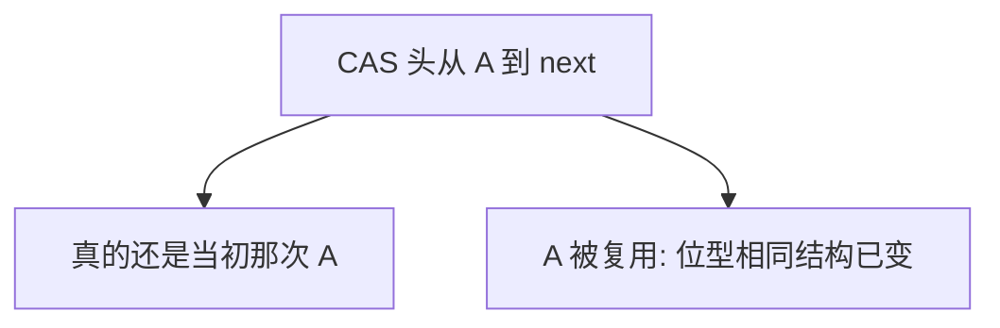

# 无锁与 ABA

CAS 成功只说明字里又出现了期望的位型；它不说明你第一次看见的那个对象还活着——这就是 ABA。

<footer>—— 据 Michael, Hazard Pointers, PODC 2004；Herlihy 无锁文献整理</footer>

[上一课](/cs/rcu-gp)让 RCU 用宽限期避免「指针还在手里、结点已释放」。无锁栈用 CAS 改头指针，往往自己回收结点。缺口是 **ABA**：头从 A 变为 B 再变回 A，CAS 仍成功，链却已乱。本课钉现象与对策直觉（版本戳、Hazard Pointer、或继续用 RCU），不写可运行的攻击构造。

## 问题

无锁：某个线程的延迟不阻止其它线程完成操作（无锁进度）。实现常用[原子 CAS](/cs/atomic-rmw) 循环。弹出栈：读头 A，读 A→next，CAS 头从 A 到 next。其间另一线程弹出 A、再弹出更多、又把 A 分配回来当头——CAS 看见头仍是 A，成功，但 A→next 已是过期值。缺口不是宽限期定义，而是 **CAS 匹配 ≠ 同一代对象**。

加标签：指针旁存版本计数，CAS 双字，使复用 A 时标签不同。Hazard Pointer：读者先公布「我正拿着这些指针」，回收者跳过。

## 方法

教学承认三条路：(1) 不回收或延迟回收（RCU/epoch）；(2) 指针打标签；(3) 冒险指针。内核链表多走 (1)。用户无锁队列要显式选。进度：无锁不等于无等待；CAS 可活锁式重试——下一组课的活锁会再点。

与[内存屏障](/cs/memory-barrier-os)：CAS 成功仍要规定节点内容何时可见。

## 机制

ABA 说明无锁正确性不能只靠「最终 CAS 成功」。RCU 的 GP 是解决「结点不能复用得太早」的一种；打标签解决「同一地址不同代」。两者都比「裸 CAS 换头」重一点，但这是正确性税。不要在教学里用具体释放后立刻 malloc 的时序当习题去复现损坏——理解结构即可。

## 边界

本课不给可编译的无锁栈完整实现当作业答案，不讨论如何利用 ABA 打堆。死锁四条件处理的是锁上的永久等待，对象不同，下一课。

后课默认：无锁仍有 ABA 与活锁重试。锁上的永久互等，下一课[死锁四个条件](/cs/deadlock-coffman)。

## 小结

- 无锁常用 CAS；ABA 是复用使位型碰巧相同。
- 对策：延迟回收、打标签、Hazard Pointer。
- 锁上的死锁是下一课。
- 出处：Michael, *Hazard Pointers*, PODC 2004；Herlihy 无锁进度定义。
