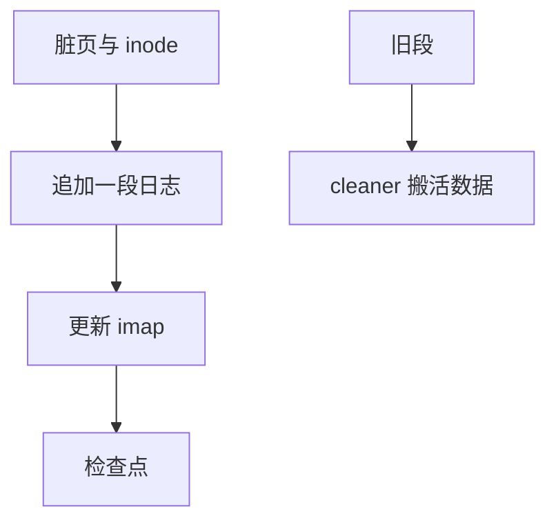

# 日志结构文件系统 LFS

把整盘当成一条无限追加的日志：新数据与新 inode 都写在日志头，旧版本靠垃圾回收收回。

<footer>—— 据 Rosenblum and Ousterhout, The Design and Implementation of a Log-Structured File System, ACM TOCS 1992</footer>

[上一课](/cs/ext4-extents)把块图收成 extent，但更新仍是**原地**：改一个 inode 就回去写那几个元数据块。[日志](/cs/ext4-journal) 只是把即将发生的原地写先抄一份。缺口是更彻底的一步：主文件系统自己就是日志。

## 问题

1990 年代内存已经能缓存读，磁盘的随机写仍贵。若所有脏数据与 inode 都排成顺序写，吞吐接近顺序带宽。代价：文件位置不再稳定，必须有 imap（inode map）指出「当前 inode 在日志的哪一段」；旧段变成垃圾，需要 cleaner。缺口不是再讲 JBD2 的 commit 块，而是 LFS 的段、检查点与 imap。

本课不把 F2FS 的多头日志提前写完。

检查点把 imap 的根与日志头钉到固定位置，崩溃后从检查点滚日志。cleaner 读段用法统计，把还活着的 inode/数据搬到日志头，释放整段。

## 方法

写：缓冲若干脏页与脏 inode，凑成一段（segment）顺序下盘，更新内存 imap，定期把 imap 页也追加进日志并写检查点。读：imap → inode → 块地址（地址现在是日志里的偏移）→ [页缓存](/cs/page-cache)。与 ext4 对照：没有「inode 表槽位永远在块组里」；槽位是逻辑号，物理位置随版本走。

## 机制

LFS 把随机元数据写变成顺序带宽，崩溃恢复顺着日志重放即可，不必 [fsck](/cs/fsck) 扫整盘——后课会对照。闪存友好是后话：当时动机是 HDD 臂。cleaner 在空闲低时与前台写争带宽，这是 LFS 的经典税。不要把 LFS 写成数据库 WAL：WAL 旁边还有堆文件；LFS 的堆就是日志本身。

VFS 仍看见稳定的 inode 号；imap 才是「号 → 日志位置」的翻译，类似 FAT 表，但指向的是版本化对象而不是簇链。

实现上：imap 本身也必须可检查点，否则崩溃后找不到任何 inode。Sprite LFS 的 cleaner 在空闲低于阈值时与前台写争带宽，这是追加布局的周期性税，不是偶发 bug。 读法上只引用[上一课](/cs/ext4-extents)的结论，不把对象换成训练推理或限价簿。

本课在操作系统进阶的「文件系统实现 / 布局与日志」课序里，对象是 **日志结构文件系统 LFS**。

- 先修只引用，不重导：上一课的结论当公理，本课只补差。
- 五栏不吞并：不把本课写成大模型训练/推理，也不写成限价簿或权重量化。
- 文献用 OSTEP、McKusick、内核文档与具名会议论文；不发明 arXiv 编号。

## 边界

本课不引入 NAND 的擦除单元与 FTL。不保证 cleaner 在满盘时仍有好的吞吐——那是实现与负载的边界。下一课看闪存上长出来的后裔：F2FS 如何用多条日志头与节点地址表落地同一直觉。

版本字段会变，课序钉的是机制对象「日志结构文件系统 LFS」，不是某一主线内核的结构体名。
后课默认：文件系统可以是追加日志加 imap。面向闪存的节点表与热冷分离，下一课 F2FS。

## 小结

- LFS 追加段；imap 翻译 inode 号；cleaner 回收旧段。
- 检查点给出崩溃后的根。
- 闪存上的多头日志是 F2FS 的缺口。
- 出处：Rosenblum and Ousterhout, TOCS 1992；*OSTEP* 对 LFS 的章节。
