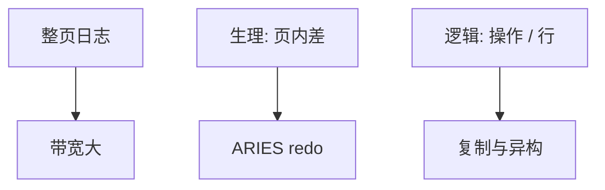

# 日志粒度

生理日志记页内字节差，redo 快、undo 要逻辑；逻辑日志记「插入键 k」，重放走索引代码。粒度决定恢复 CPU、交叉与复制形态。

<footer>—— 据 Gray and Reuter；Mohan 生理日志；逻辑复制谱系</footer>

[上一课](/cs/fuzzy-checkpoint)钉了检查点快照。本课不刷脏。缺口是一条日志记什么：整页（page logging）浪费带宽；字节级生理；操作级逻辑；行级。主干 WAL 未选粒度。进阶对照，影子分页下一课是另一恢复族。

## 问题

生理（physiological）：在页号已知的页上应用字节差或槽操作，不重走 B+ 查找。redo 快、依赖 pageLSN。逻辑：`insert into T values (...)`，重放必须可再执行查询代码，页布局可变，适合逻辑复制与异构引擎，redo 慢且要处理非确定性。混合：redo 生理、undo 逻辑（ARIES）。

缺口是**交叉**：同一页上未提交与已提交更新，生理 undo 用补偿；逻辑 undo 用逆操作。粒度越粗（整页），写放大越大、并发更互斥。

Gray 对 logging 粒度。MySQL binlog 行/语句、Postgres WAL 生理+logical decoding 是产品线。本课分类。

## 方法

OLTP 本地恢复：生理 redo + CLR。跨版本升级、逻辑备库：从生理 WAL 解码成行（logical decoding）或直接逻辑日志。语句级逻辑：`UPDATE t SET x=x+1` 在重放时非确定性若有触发器——行级更安全。

压缩：redo 差量。加密：日志也要 TDE，否则数据页加密无意义。

## 机制

组提交把多粒度记录一起刷。并行 redo 按页分区要求生理带页号。逻辑重放常单线程或按表分区，冲突检测像 OCC。

与 Calvin：输入日志是事务级逻辑，执行再产生理——两层。

## 边界

本课不讲影子页对照。也不把 binlog 格式当标准。RTO 依赖粒度：生理 redo 吞吐高。

后课默认：单机恢复用生理；跨引擎用逻辑行。影子分页：写新页，根指针切换，对照 WAL 原地更新。

粒度是恢复与复制的同一设计轴。

## 小结

- 生理 redo 快、绑页；逻辑可移植、重放重。
- ARIES 常用 redo 生理 + undo 逻辑。
- 影子分页对照下一课。
- 出处：Gray and Reuter；ARIES；逻辑解码实践。
