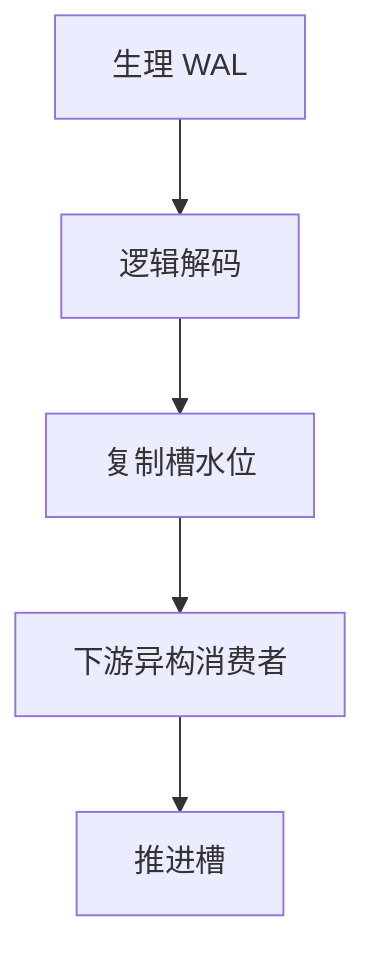

# 逻辑复制与 CDC

从 WAL 解出行级变化流：下游可异构、可过滤表。这是逻辑日志的消费者，不是备库再应用生理 redo。

<footer>—— 据 Postgres logical decoding；Gray；CDC 实践；日志粒度课落地</footer>

[上一课](/cs/backup-pitr)把 WAL 当 PITR 原料。本课把同一 WAL（或触发器）当成变化数据捕获（CDC）流。主干 [复制与日志传送](/cs/replication-log) 偏物理。进阶：逻辑复制解码成 `INSERT/UPDATE/DELETE` 行像，给搜索索引、数仓、缓存。半同步下一课仍偏物理耐久。

## 问题

物理复制：同引擎、同版本、全库页。逻辑：表子集、转换、多下游。缺口是**解码与槽**：保持解码所需的 WAL 与旧行像（undo/堆版本），槽不消费则磁盘涨——与 MVCC 水位同一类钉子。顺序：事务提交序要在流里可见，否则下游聚合错。

全量+增量：先快照再从 LSN 接流，避免漏。DDL：逻辑流对模式演化敏感，迁移课的兼容窗口在此显现。

PostgreSQL logical decoding、MySQL binlog 行模式。Debezium 一类是生态。本课机制。无虚构论文号。

## 方法

输出插件：把事务变化写成 JSON/protobuf。下游幂等：用 LSN 或主键+版本去重。恰好一次后课流系统再谈；库侧至少 at-least-once 加幂等键。

过滤：只发某些表，减少流量。大对象可跳过或另通道。

## 机制

性能：解码 CPU、undo 读旧像。长事务一个大包提交时下游突发。与 SSI/锁无关直接，但未提交变化不应出现在流（按提交）。

冲突：多源写入下游要合并策略，本课单源。双向复制是另一事故源。

## 边界

本课不讲半同步 ACK。也不把 CDC 当 2PC。搜索引擎索引常用 CDC 填倒排。

后课默认：异构下游用逻辑 CDC+槽；同构 HA 用物理。半同步复制：提交等备库确认，换 RPO。

槽是消费者的 xmin，忘记 drop slot 会胀爆磁盘。

## 小结

- 逻辑复制从 WAL 解码行流，槽钉水位。
- 接流要快照对齐；DDL 要合同。
- 半同步复制下一课。
- 出处：logical decoding；Gray；CDC 实践。
