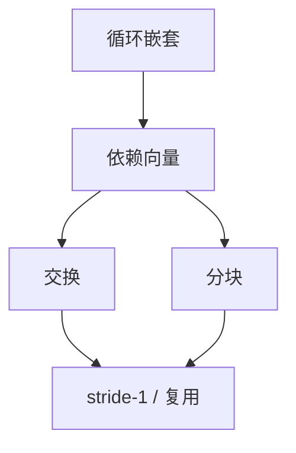

# 循环交换与分块

交换嵌套使最内层走连续地址；分块把迭代空间切成缓存大小的瓷砖。合法性由依赖是否被保持决定。

<footer>—— 据 Wolf and Lam, A Loop Transformation Theory, 1991；Allen and Kennedy；龙书局部性变换整理</footer>

上一课[展开与剥离](/cs/loop-unroll-peel)复制同一嵌套。缺口是**改迭代顺序**：矩阵乘 `i,k,j` 对缓存极差；交换与 tiling 把重用留在 cache。[缓存层次](/cs/inclusive-exclusive-cache) 已给局部性；本课是编译器如何改循环。依赖分析点名，别名后课补内存。

## 问题

依赖：若迭代 $\vec{i}$ 写、$\vec{j}$ 读同一位置，$\vec{j}-\vec{i}$ 是依赖向量。交换合法当置换后依赖仍在时间上向前（不把流依赖变成反方向）。分块：把矩形切成 $B\times B$，块间顺序仍须尊重依赖。缺口是**变换合法性**，不是展开因子。

列主序与行主序语言不同，交换目标是使最内层 stride-1。

### 分块不是「再展开一次」

展开不改访问序的大结构；tile 改空间局部性。二者可在瓷砖内再展开。

Wolf–Lam 1991。Lam 的 cache blocking。多面体后课把这套代数化。本课用依赖向量直觉。

## 方法

对完美嵌套估计依赖（下标为 IV 仿射时）。尝试交换使最内层连续。选 $B$ 使 $B^2$ 个元素进 cache。带规约的循环：依赖是特殊的，常仍可分块（浮点结合律问题点名 fast-math）。

与 LICM：分块后不变式仍外提。不要在有未知函数调用的循环上盲交换。

## 机制

非法交换会改语义（不只变慢）。编译器必须放弃或用运行时别名检查（版本化循环）。数组可重叠时需[别名](/cs/alias-analysis)。

寄存器 tiling 是把块再缩到寄存器文件，与分配交互。

## 边界

本课不写完整多面体 ILP。后课默认：仿射嵌套可试交换与分块。下一课自动向量化：最内层变成 SIMD。

也不把 GPU 的 block 当本课 tiling 的定义，尽管同思想。

## 小结

- 交换改嵌套顺序以对齐连续访问；合法性看依赖。
- 分块按缓存切迭代空间。
- 与展开不同层；可组合。
- 出处：Wolf and Lam, 1991；Allen and Kennedy；龙书。
