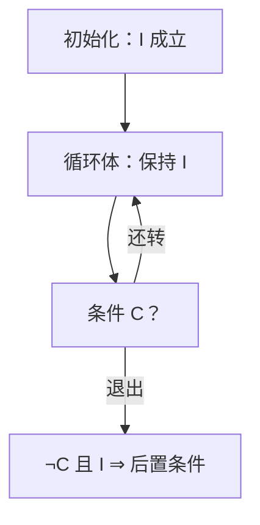

# 循环不变式

若一条断言在进入循环前成立，每轮保持，终止时又推出目标，则循环做对了它该做的事。

<footer>—— 据 Floyd, Assigning Meanings to Programs, 1967；Hoare, An Axiomatic Basis for Computer Programming, 1969 整理</footer>

上一课[平面图直觉](/cs/planar-graph)给了图表示一课的边界：何时平面、何时不必。数据结构课到此结束：对象、代价和表示都齐了。本课不重画邻接表，也不从「算法是什么」另起。缺口是：图和数组上的过程多数是**循环**，正确性不能只靠跑几个例子。本课只交出循环不变式；[渐近记号](/cs/asymptotic-notation)已经有了，时间另算。

## 问题

一段 `for` 把数组左段排好、或把距离数组逐步改紧，肉眼看「好像对」。换输入、换边界，断言就散。缺口不是新的数据结构，而是把循环切成可归纳的三截：**初始化**进入前成立，**保持**每轮体执行后仍成立，**终止**退出时不变式加上循环条件的否定推出后置条件。

没有这三截，后课插入排序、Dijkstra 的「已确定集合」都只能口头讲。本课不引入霍尔三元组的全部演算，只要求：循环有一条关于部分结果的断言，且它可归纳。

### 不变式不是循环条件

循环条件回答「还要不要再转」；不变式回答「到这一步，哪些已经对了」。两者同时成立才推出目标。把「`i < n`」当成不变式，终止时什么也推不出。

Floyd 在框图节点上贴断言；Hoare 把 `{P} S {Q}` 写成推理规则。CLRS 第 2 章用插入排序当第一份作业：左段已排序。本课沿这条线，不把程序逻辑做成独立课程。

## 方法

选定循环变量（下标、已处理前缀、已确定顶点集）。写出：第 $i$ 轮开始时，前缀或集合 $S$ 满足性质 $I$。证明进入时 $I$ 真；一轮只动允许动的那一块，动完 $I$ 仍真；退出时 $\neg C \land I$ 给出输出约定。

归纳法在[数学归纳](/cs/mathematical-induction)已有。这里的归纳指标是轮数，不是「对 $n$ 归纳整个程序」。递归过程的正确性可以另写递归不变式；本课先钉迭代。

## 机制

有了不变式，修改循环时知道什么不能碰：破坏 $I$ 的赋值必须补一条恢复。后课分治把问题切成子问题，正确性改走递归假设；本课的循环是同一层对象上的逐步扩大。两者会在归并、快排里交替出现，不要混成一句「都是归纳」。

不变式也可以带资源：已用比较次数、已松弛的边。那是分析，不是正确性本身。本课只要求部分结果为真；[主定理](/cs/master-theorem)才处理递归式的渐近。

## 边界

不变式不自动给出终止。要另证：某个非负势函数每轮严格下降，或循环变量有界递增。也不处理并发：多线程下「看起来保持」可以对交错失败。本课默认顺序执行。

后课默认：写一个迭代算法，先给出不变式再谈 $\Theta$。插入、堆排、BFS 层、Dijkstra 的 $S$，都是本课的实例，不再从 Floyd 重讲。

## 小结

- 循环正确性 = 初始化 + 保持 + 终止时推出后置条件。
- 不变式描述部分结果，不是循环条件本身。
- 终止要另证；本课不处理并发。
- 出处：Floyd, 1967；Hoare, 1969；Cormen, Leiserson, Rivest and Stein, *Introduction to Algorithms* 第 2 章。
