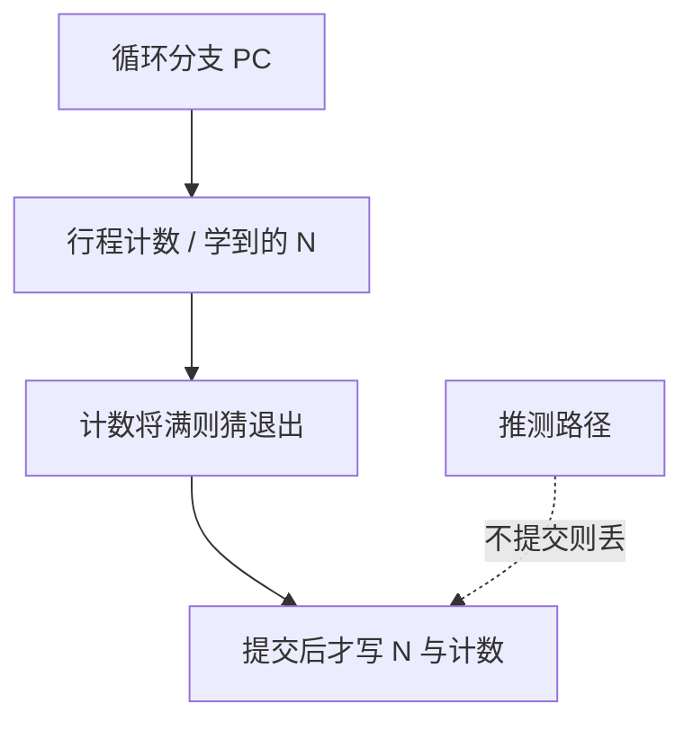

# 循环预测与预测器训练

循环分支在 $N-1$ 次时成功、最后一次失败：饱和计数器必在出循环时错一次；记下 $N$ 就能在第 $N$ 次故意猜失败。

<footer>—— 据 Sherwood and Calder 等对循环终止预测的论述；Seznec 将循环器接入 TAGE 族 整理</footer>

[上一课](/cs/indirect-branch-predict)处理多目标地址。循环结尾的条件分支目标通常是立即数，方向却呈「111…10」：gshare 与 TAGE 能记相关，但对规整的行程长度仍浪费表项，且出循环那一次几乎总误预测。本课不重做 ITT。缺口是**专用循环计数器**，以及预测器**何时更新**——推测中的训练会把表写坏。

## 问题

`for (i=0;i<N;i++)` 的向后分支：两位计数器在稳定期几乎全对，但每次离开循环必错，再进入时可能再错一次才饱和。$N$ 若在一段时间内不变，硬件可以学这个 $N$。缺口不是更长的 GHR，而是**检测「同一 PC 连续成功 $k$ 次后失败」并在第 $k$ 次输出失败**。

训练时机：若在推测路径上就把成功填进循环计数，误预测路径上的假循环会把 $N$ 学成垃圾。与 [gshare](/cs/gshare-predictor) 的 GHR 检查点是同一纪律，本课把它钉死在循环器上。

许多实现把循环预测器当作 TAGE 的提供旁路：检测到规则循环则覆盖几何表的输出。Intel 优化手册所称 loop detector 是同一直觉。

## 方法

循环表按 PC 索引：存当前行程计数、学到的行程 $N$、置信度。每次该分支成功则计数 +1；失败则把计数与 $N$ 比较，相等则置信上升，否则重学 $N$。预测：若计数 +1 将达到 $N$，猜失败，否则成功。

与 TAGE/感知器竞赛：循环器置信高则采用，否则退回通用预测。

## 机制

CPI：出循环那一次从「必错」变成「可对」，对短循环、高分支密度的核可测。$N$ 变化（数据相关的 trip count）时置信下降，自动让位给 TAGE。嵌套循环要多路或多 PC：内层 $N$ 稳定、外层每次改内层起点，别名仍可能。

训练纪律推广到所有预测器：架构状态（GHR、$N$、权重、TAGE 分配）以提交为准；推测更新必须可回滚。这为下一课「推测执行与恢复」准备好：预测器是微结构状态，恢复算法必须把它算进去。

## 边界

本课不把循环展开后的多条分支合成一个计数器。也不把软件 profile 的 trip count 当成硬件 $N$ 的替代——那是编译课。间接跳转的「循环」是目标序列，不是本课的 0/1 行程。

后课默认：规则 trip count 可走专用计数器；任何预测表的更新以可恢复为前提。窗口里已经按预测执行的指令，错了怎么扔，是下一课。

## 小结

- 循环器记下行程 $N$，把出循环那一次从必错变成可预测。
- 预测器训练以提交为准，推测更新要能回滚。
- 窗口内的指令如何按预测执行再冲刷，是下一课恢复。
- 出处：Sherwood and Calder；Seznec TAGE 族中的循环组件；Hennessy and Patterson, *CA:AQA*。
