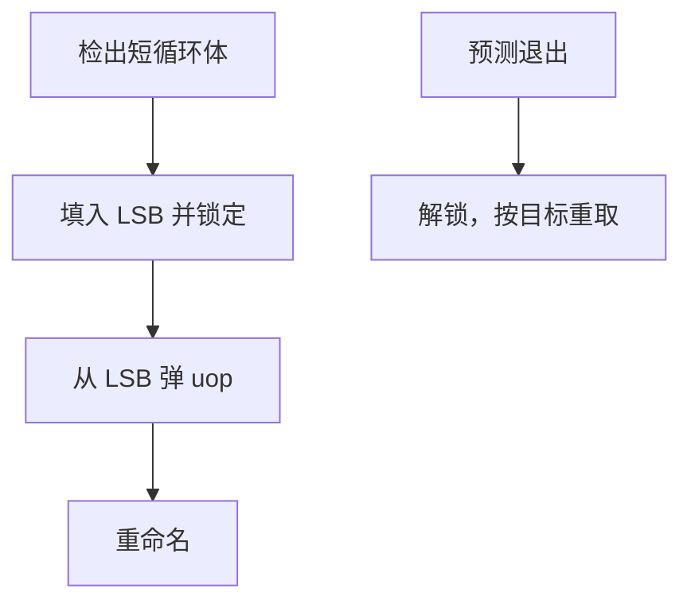

# 循环流缓冲

一旦认出循环体已经全部译码进一小块缓冲，取指单元可以休眠：uop 从缓冲循环供给，直到退出分支被预测为离开。

<footer>—— 据 Intel 对 Loop Stream Detector 的公开描述；Hennessy and Patterson, CA:AQA 整理</footer>

[上一课](/cs/uop-cache)用按 IP 索引的 uop cache 绕过译码器，每拍仍要做标签比较、仍可能跨行。[循环预测](/cs/loop-predictor)已经能猜何时离开。本课不重讲 DSB 填入。缺口是把**足够小的循环锁定在更浅的流缓冲**，连 uop cache 的查找都关掉。

## 问题

科学计算与多媒体里，十几到几十 uop 的循环会跑百万次。uop cache 命中已经便宜，但取指流水、BTB 读口、分支预测查表仍在跳。缺口不是更大的 uop cache，而是**检测「循环体已完整驻留」后切换到从 LSB 顺序弹出 uop**，退出才回到普通前端。

Intel Core 起的 LSD（Loop Stream Detector）有 uop 数上限；体太大、含过多分支或调用则不锁定。这是功耗与前端端口的交易，不是新的 ISA 循环指令。

## 方法

前端统计连续向后分支且目标落在近期已译码窗口内。若循环体 uop 数 ≤ 缓冲容量、且满足「无调用、间接可预测」等实现限制，把该体复制进 LSB，置锁定。供给：每拍从 LSB 取 $D$ 个 uop，IP 在体内绕回。循环预测器说「这一次退出」则解锁，从退出目标重新走 BTB/uop cache。

## 机制

功耗：I-cache、uop cache、相当一部分预测器读口可以门控。带宽：LSB 的端口按重命名宽度设计，不再被 cache 行对齐打断。与[循环器](/cs/loop-predictor) 的配合：行程 $N$ 决定何时解锁；LSB 本身不学 $N$。

自修改或 SMC 仍要打破锁定。异常与误预测同样解锁并冲刷——LSB 不是架构状态。

## 边界

本课不把软件展开后的巨循环硬塞进 LSB。也不把 GPU 的循环缓冲、DSP 的零开销循环指令当成同一结构：那些是 ISA 可见的。宏融合会改变「几条宏指令对应几个 uop」，影响能否装进容量，下一课才讲融合。

后课默认：短热循环可以在 uop cache 之下再短一截供给路径。把相邻宏指令合成更少 uop，是另一条减前端压力的路。

## 小结

- LSB 锁定短循环的 uop 流，让取指与部分预测器休眠。
- 容量与分支限制决定能否锁定；退出靠循环预测。
- 减少 uop 条数的融合是下一课。
- 出处：Intel 优化参考手册中的 LSD；Hennessy and Patterson, *CA:AQA*。
