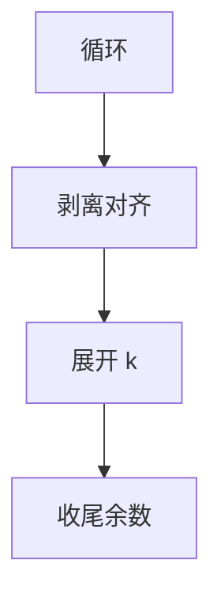

# 循环展开与剥离

展开把循环体复制 $k$ 次，减少分支与暴露调度窗口；剥离处理不对齐的头几圈，使主循环满足向量或缓存假设。

<footer>—— 据 Allen and Cocke 变换目录；龙书循环展开；Kennedy and Allen, Optimizing Compilers for Modern Architectures 整理</footer>

上一课[强度削弱](/cs/strength-reduction-iv)减每圈算术。缺口是**圈结构本身**：展开（unroll）、剥离（peel）、余数循环。本课钉何时复制体，不写自动向量化的依赖分析——后课。也不把展开当软件流水。

## 问题

每圈一次条件跳，对小体是开销；超标量要更多独立指令。展开 $k$：计数器步进 $k$，体复制，IV 已削弱则可直接写 $k$ 份地址。余数：`n%k` 用剥离或收尾循环。缺口是**因子 $k$ 与代码大小**，不是 IV 识别。

完全展开：行程编译期常量则变成直线代码，再 SCCP/DCE。

### 剥离不是展开

剥离：先跑 1 至若干圈（处理对齐、第一次迭代的特殊别名），再进主循环。展开是主循环体内复制。常组合：剥到对齐，再按向量宽度展开。

Kennedy–Allen 的教材。龙书。PGO 后课用轮廓选 $k$。本课静态启发：体大小、行程估计。

## 方法

估计：体指令数 × $k$ 是否超过阈值。已知 `n` 则选整除的 $k$。未知则收尾循环。剥：对「首圈必执行的不变量 store」有时比 LICM 更易证明。

与寄存器压力：展开拉长存活区间，着色更难——后课线性扫描会痛。

## 机制

不要展开带可变行程且巨大的体。调试：行号映射多份体到同一源行，DWARF 后课。不要改变浮点归约顺序除非 fast-math。

并行：展开不创造并行；只给调度与向量化窗口。

## 边界

本课不写多面体。后课默认：小体、常行程可展开；对齐用剥离。下一课交换与分块：改迭代嵌套的顺序与粒度。

也不把展开当混淆（故意胀代码）。

## 小结

- 展开复制体、降分支、开调度窗口；余数要收尾。
- 剥离服务对齐与首圈特例。
- $k$ 受代码大小与寄存器压力约束。
- 出处：Allen and Cocke；Kennedy and Allen；龙书。
