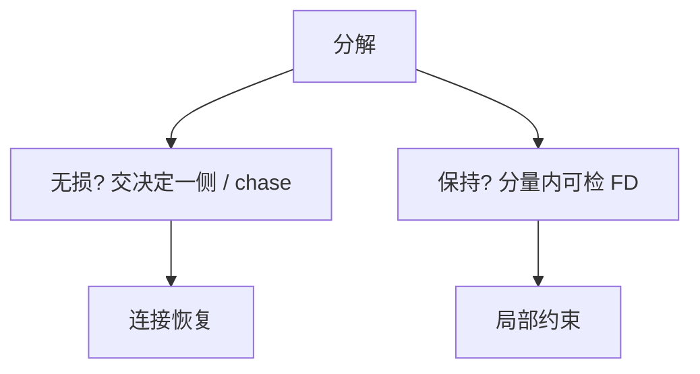

# 无损分解与依赖保持

无损：投影再连接能回到原关系。保持：每条 FD 仍能在某一个分量上检查。两项目标可拆开，BCNF 常常保不住后者。

<footer>—— 据 Rissanen；Aho, Beeri and Ullman；Bernstein；主干 BCNF/3NF 课的形式补全</footer>

[上一课](/cs/fd-closure-min-cover)给出闭包与正则覆盖。本课不重写扩张算法。缺口是分解质量：主干 [BCNF 与 3NF 取舍](/cs/bcnf-3nf) 已经用自然语言说了无损与保持；进阶给出判定。查询语言的连接这时是「恢复原关系」而不是「用户写了 JOIN」。

## 问题

把 $R(U)$ 拆成 $R_1(U_1), R_2(U_2)$，$U_1 \cup U_2 = U$。无损连接：任何满足 $F$ 的实例 $r$，$r = \pi_{U_1}(r) \bowtie \pi_{U_2}(r)$。二元分解有简便条件：$U_1 \cap U_2 \to U_1$ 或 $U_1 \cap U_2 \to U_2$ 被 $F$ 蕴含（交决定某一侧）。多路分解用 tableau 追赶（chase）：不等价则追赶出矛盾或多出行。

依赖保持：存在覆盖，使每条 FD 的左右部都落在某一个 $U_i$ 内。否则要先连接再检查 FD，运行时贵，也容易漏检。3NF 合成保证无损且保持；BCNF 分解保证无损，不保证保持。

Aho, Beeri, Ullman 用 tableau 形式化无损。chase 按 FD 把符号行填齐。本课要的是判定条件，不把 chase 的全体依赖类型写完。

## 方法

二元：算交 $X = U_1 \cap U_2$，闭包看是否盖住某一侧。多路：从「一行一块分量投影」的 tableau 出发 chase，看是否能合成原行。保持：把 $F$ 限制到各 $U_i$ 再算覆盖并，看是否与 $F$ 等价（用闭包比）。

反例（经典）：两个重叠候选键导致 BCNF 分解丢掉一条跨分量 FD。设计选择回到主干取舍课：容忍冗余（3NF）或容忍跨表检查（BCNF）。

## 机制

无损失败：连接制造虚假元组（悬挂元组拼出从未存在的组合），查询会多行。保持失败：合法分解实例可能暂时违反原 $F$，直到连接才发现——约束若只建在分量上则漏。触发器跨表检查是工程补丁，不是保持性。

视图可以用连接恢复外模式，但视图更新异常仍在：无损保证读回，不保证写可唯一翻译。

## 边界

本课不引入多值依赖——下一课 4NF。也不把水平分片（按行切）与投影分解混为一谈；水平切是后课分区与分片。chase 对一般嵌入依赖可不可停，本课不进。

后课默认：说到分解，先问无损，再问保持。4NF 处理的是独立多值事实，不是又一条 FD。

两条轴独立：可以无损不保持，也可以（不当分解）保持但有损——后者不可用。

## 小结

- 无损：连接不制造假行；二元时交决定一侧。
- 保持：FD 可在单表上检查；3NF 合成保两条，BCNF 不总保保持。
- 多值依赖与 4NF 下一课。
- 出处：Rissanen；Aho, Beeri and Ullman；Bernstein。
