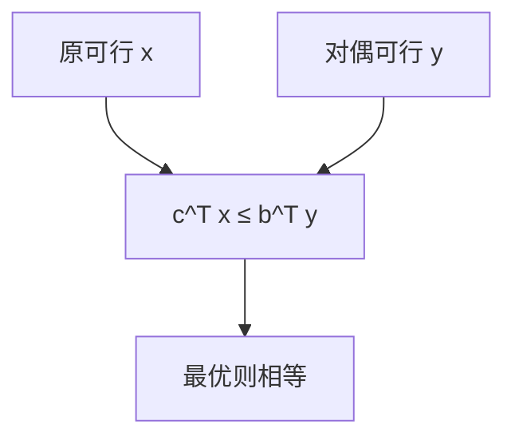

# LP 对偶

每个约束一张对偶变量；弱对偶给目标上界，强对偶在最优处相等，互补松弛刻画最优基。

<footer>—— 据 Dantzig, 1963；von Neumann 的对偶观察；CLRS 第 29 章整理</footer>

上一课[单纯形](/cs/simplex)在原问题上转轴。缺口是对偶 LP：$\min b^\top y$，$A^\top y\ge c$，$y\ge 0$（形式随标准形变）。弱对偶：$c^\top x\le b^\top y$ 对任意可行对。强对偶：都可行则最优值相等（有限时）。不重写转轴表。后课整数规划对偶间隙可正。

## 问题

原 $\max c^\top x$，$Ax\le b$，$x\ge 0$。对偶 $\min b^\top y$，$A^\top y\ge c$，$y\ge 0$。最大流最小割是对偶的组合影子。匹配顶标（KM）是指派问题的对偶。缺口是这张表，不是再跑单纯形。

无界原问题 $\Rightarrow$ 对偶不可行，反之亦然（弱对偶）。

### 不是拉格朗日乘数课的重写

对偶可从拉格朗日来，本课认 LP 教科书构造：约束 $\leftrightarrow$ 变量，右端 $\leftrightarrow$ 目标。内点法用障碍，后课。

CLRS 29.4–29.5。最大流最小割、König 是强对偶实例。后课分支定界：整数使对偶间隙出现。

## 方法

写出对偶。用弱对偶证界。用互补松弛检查 $(x,y)$：松弛约束对应零对偶，正变量对应紧约束。

单纯形最优基同时给对偶解。

## 机制

弱对偶：把约束加权 $y$ 与目标比。强对偶：多面体几何或单纯形终止时检验数给出 $y$。与 KM：顶标即 $y$，相等子图即互补松弛。与最小割：割容量是对偶可行。

## 边界

本课不证强对偶的 Farkas 全文。非线性对偶不写。后课默认：LP 有强对偶；组合算法常是原–对偶。下一课整数规划与分支定界。

## 小结

- 弱对偶始终给界；强对偶最优相等。
- 互补松弛连接原与对偶。
- 流–割、顶标是实例。
- 出处：Dantzig, 1963；CLRS 第 29 章。
