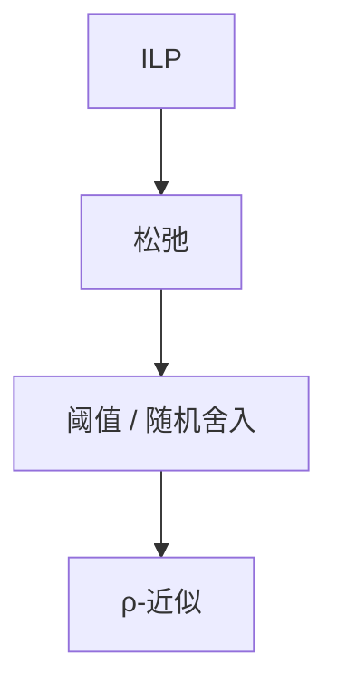

# LP 松弛与舍入

整数约束放松成 $[0,1]$；分数解舍入（随机或按阈值）给出近似，比由 LP/OPT 积分间隙控制。

<footer>—— 据 Raghavan and Thompson, Randomized Rounding, 1987；CLRS 第 29、35 章；[LP 对偶](/cs/lp-duality) 整理</footer>

上一课[Christofides](/cs/christofides)是组合构造。许多问题先写 ILP，松弛为 LP，多项式可解（内点/单纯形）。缺口是舍入：顶点覆盖分数解 $x_u\ge 1/2$ 则取，$2$-近似；集合覆盖随机舍入期望 $O(\log n)$。不重写单纯形。后课背包 FPTAS 另一路线。

## 问题

积分间隙：$\sup\mathrm{OPT}/\mathrm{OPT}_{LP}$。舍入比不会优于间隙。随机舍入：独立以 $x_i$ 为概率取，Chernoff 管约束破坏再修。依赖舍入、迭代舍入点名。

缺口是从分数到整数，不是分支定界精确。

### 松弛公式要选对

坏 ILP 公式间隙大。顶点覆盖标准 LP 间隙 2。要证明近似须对公式。

Raghavan–Thompson 1987。Goemans–Williamson 最大割 SDP 后课局部搜索旁点名。后课背包伪多项式 $\to$ FPTAS。

## 方法

建模 ILP $\to$ 松弛 $\to$ 解 LP $\to$ 舍入。用对偶拟合证比。检查间隙实例。

无界间隙则此路失败。

## 机制

弱对偶：分数 OPT_LP 是整数 OPT 的界。舍入放大变量，约束用概率。与分支定界：那里用界剪枝求精确；这里一次舍入。与 KM 顶标：那是精确对偶，间隙 0。

## 边界

本课不写 SDP 切平面。不写全部 Raghavan 分析。后课默认：近似可走 LP 舍入，比受间隙限制。下一课背包 FPTAS。

## 小结

- 松弛 + 舍入；比 $\ge$ 积分间隙。
- 随机舍入 + 集中不等式。
- 公式选择决定间隙。
- 出处：Raghavan and Thompson, 1987；CLRS。
