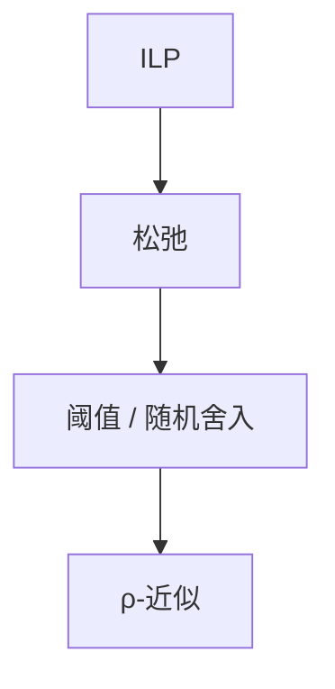

# LP 松弛与舍入

整数约束放松成 $[0,1]$；分数解舍入（随机或按阈值）给出近似，比由 LP/OPT 积分间隙控制。

<footer>—— 据 Raghavan and Thompson, Randomized Rounding, 1987；CLRS 第 29、35 章；[LP 对偶](/cs/lp-duality) 整理</footer>

上一课[Christofides](/cs/christofides)走组合构造：近似比直接从度量性质读出。本课换一条路线：先写整数线性规划（ILP），把整数约束松弛成 $[0,1]$ 得到 LP，多项式可解。缺口在松弛之后——LP 给出的多是分数解，必须舍入成整数。舍入得当即得近似：顶点覆盖按阈值 $x_u\ge 1/2$ 则取，$2$-近似；集合覆盖随机舍入期望 $O(\log n)$。后课[背包 FPTAS](/cs/knapsack-fptas)是缩放价格的一路，不经 LP。

## 问题

核心量是**积分间隙**：$\sup\mathrm{OPT}/\mathrm{OPT}_{LP}$，即最坏情形下整数最优与分数最优之比，它钉住舍入的天花板：近似比不会优于间隙。随机舍入的做法：独立地以 $x_i$ 为概率把变量取成 $1$，期望与分数解一致；约束被破坏的概率用 Chernoff 界住，超出再修补或调阈值。依赖舍入、迭代舍入只点名，本课不展开。

缺口是从分数回到整数、近似即可，不是精确搜索。

### 松弛公式要选对

同一问题能写出多个 ILP 公式，间隙各不相同：坏公式的 LP 松弛值远低于整数最优，舍入再好也救不回。顶点覆盖标准公式间隙是 $2$——每条边至少一端选，全取 $1/2$ 即可行。要证明近似比，论证必须绑定在这个公式上；换公式等于换间隙。

Raghavan–Thompson 1987 把随机舍入做成通用方法，用 Chernoff 界顶住约束破坏。Goemans–Williamson 最大割 SDP 后课局部搜索旁点名。后课背包伪多项式 $\to$ FPTAS。

## 方法

流程固定四步：建模 ILP $\to$ 松弛 $\to$ 解 LP $\to$ 舍入。证比常用对偶拟合：构造对偶可行解，把它的值与整数解按常数比例挂起，比值即近似比。拿到算法后要检查已知间隙实例，看比还能压到哪。

```mermaid
flowchart TD
  ILP["ILP"] --> LP["松弛"]
  LP --> RND["阈值 / 随机舍入"]
  RND --> APX["ρ-近似"]
```

无界间隙的公式则此路失败：分数最优能被任意压低，只能换公式或换路线。

## 机制

弱对偶保证 $\mathrm{OPT}_{LP}$ 是整数 OPT 的界：松弛放大可行域，最小化时分数值只会更低，舍入比因此可拆成舍入损失乘以间隙。随机舍入里约束不再硬性成立，改用概率：期望满足，破坏概率被集中不等式压小。与分支定界的分工：那里用界剪枝、追求精确，最坏指数时间；这里一次舍入收工，只保近似。与 KM 顶标对照：那是精确对偶，间隙 $0$，故无须舍入。

## 边界

本课不写 SDP 与切平面，也不复现 Raghavan–Thompson 的完整 Chernoff 分析。后课默认：近似可走 LP 舍入，但比受积分间隙限制，公式选错则上限提前锁死。下一课背包 FPTAS。

## 小结

- 松弛 + 舍入；近似比不优于积分间隙。
- 随机舍入以期望保值，集中不等式管约束。
- 公式选择决定间隙，进而决定比的上限。
- 出处：Raghavan and Thompson, 1987；CLRS。
