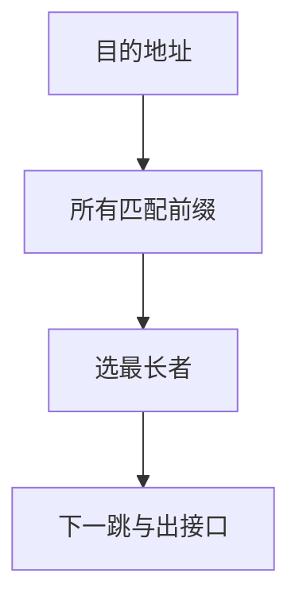

# 最长前缀匹配

路由表里多条前缀都能对上目的地址时，选前缀最长的那一条；那是最具体的网络。

<footer>—— 据 Fuller 等, RFC 1519, Classless Inter-Domain Routing；RFC 4632 整理</footer>

[上一课](/cs/cidr-agg)给出前缀与「是否直连」。一张表里同时有 `10.0.0.0/8` 与 `10.1.2.0/24` 时，目的 `10.1.2.9` 两条都匹配。缺口是**最长前缀匹配（LPM）**：CIDR 下的查找规则。本课不把硬件 TCAM 结构写完，也不引入 BGP 策略。

## 问题

分类地址曾用首几位决定类，查找简单但粗。CIDR 允许任意长度前缀，路由聚合才压得住全球表。聚合后必须保留「例外更具体」：一个 /16 里挖出的 /24 走另一下一跳。缺口不是 ARP，而是比较匹配前缀的长度，最长者胜；都没有则默认路由 `/0`。

本课不把 trie 压缩的论文细节当必背。

等价：把地址与前缀掩码逐条与，在命中者中选掩码一比特最多的。实现用树或 TCAM 并行。

## 方法

转发表：若干 (前缀, 下一跳, 出接口)。查找：LPM 得下一跳，再对该接口 [ARP](/cs/arp)（或已缓存）。主机上的「默认网关」就是一条 `/0`。多条等长前缀若下一跳不同，属于等价多路径，本课只点名，不把哈希分流写完。

## 机制

LPM 让互联网可以分层编号又保留例外，这是后课链路状态与 BGP 填表时默认的查找语义。与[页表](/cs/paging-vm)的多级翻译不同：那里是固定切分虚地址；这里前缀长度可变。不要把 LPM 说成页表。TTL 用尽在本课仍不解释 ICMP，只承认包会被丢。

端到端：LPM 选错下一跳是配置问题，IP 不重试另一条，除非路由协议改表。传输层会当丢包。

## 边界

本课不引入 SRv6 与策略路由的全部选择器（源地址、标记）。不把 TCAM 功耗写成体系结构课。控制平面如何算出这些前缀，是距离向量与链路状态的缺口；本课假定表已经在。

默认路由与「没有路由」不同：前者匹配一切，后者才触发 ICMP 不可达。主机可以只有默认，路由器通常还要直连。

更具体的黑洞路由（丢弃）也靠最长匹配压过较宽的通告，运维上要小心顺序。

后课默认：转发查找是 LPM。包无法投递或 TTL 用尽时，网络层要向源报告，下一课 ICMP。

## 小结

- CIDR 下多匹配时取最长前缀。
- 默认路由是长度为 0 的前缀。
- 控制平面填表是后课；不可达报告是 ICMP。
- 出处：RFC 1519；RFC 4632；Kurose and Ross。
