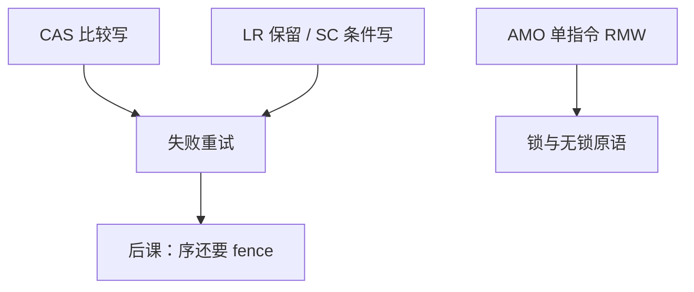

# 原子指令：LR/SC 与 CAS

  
多核要在内存上读改写而不夹缝：比较并交换一次给新值，或先保留加载再条件存储，失败则软件重试。

  <footer>—— 据 The RISC-V Instruction Set Manual；ARM ARM；Intel SDM；Herlihy and Shavit, The Art of Multiprocessor Programming 整理</footer>

[上一课](/cs/arm-vs-riscv)把两家 RISC 放到同一家族。组成/体系结构的缓存一致性假定有原子原语。缺口是 ISA 如何暴露：**CAS**（x86 `lock cmpxchg`，ARM LSE）与 **LR/SC**（RISC-V `lr`/`sc`，ARM `ldxr`/`stxr`）。

## 问题

`lock; add` 一类 RMW 在缓存行上获取排他。CAS：读、比较、相等才写，返回旧值。LR/SC：`lr` 登记保留集，若中间无干扰 `sc` 成功。缺口不是 MESI 状态名，而是**软件循环**：CAS 失败重试；SC 失败重试；ABA 要用标签或 LL/SC 的保留语义缓解。

AMO（RISC-V `amoadd`）把常见 RMW 做成单指令，减少循环。x86 的 `lock` 前缀给读改写指令。

### LR/SC 不是「总线锁住到 sc」

现代实现用缓存保留，干涉可能来自一致性失效或异常。过于复杂的保留窗口里插太多指令，实现允许 `sc` 一直失败（前进保证是架构约束）。把 LR/SC 当关中断的临界区，多核仍会打架。

RISC-V `A` 扩展；ARM 独占监视器；Intel `cmpxchg`。Herlihy/Shavit 给无锁算法背景。本课不写完整 C++ memory_order 表——下一课 fence。

## 方法

自旋锁：CAS 把 0 改 1。无锁栈：CAS 改头指针。RISC-V：`lr.w; 改寄存器; sc.w` 循环。ARM：`ldaxr/stlxr` 带获取/释放变体。失败开销：缓存行来回，与 [DRAM](/cs/row-buffer-bank-conflict) 无关但与一致性流量有关。

I/O 设备寄存器通常不可用 CAS 当锁，除非规范说可以；MMIO 副作用不同。

## 机制

下一课内存序：原子指令往往自带 acquire/release 变体，普通 store 仍可重排。本课只钉「不可分割的读改写」。微码 x86 `lock` 前缀让那条指令的 μop 带锁前缀语义。

## 边界

本课不证明线性一致性全部定理，不把 STM 写进来。不讨论 GPU atomics 的作用域。不进入交易所撮合——禁止限价簿。

后课默认：多核同步用 CAS 或 LR/SC（及 AMO）；失败重试；ABA 要额外设计。

## 小结

- CAS 一次比较并写；LR/SC 两拍保留。
- 实现靠缓存排他，不是关中断。
- 成功仍可能需要 fence 才能看见数据。
- 出处：RISC-V ISA；ARM ARM；Intel SDM；Herlihy and Shavit。
