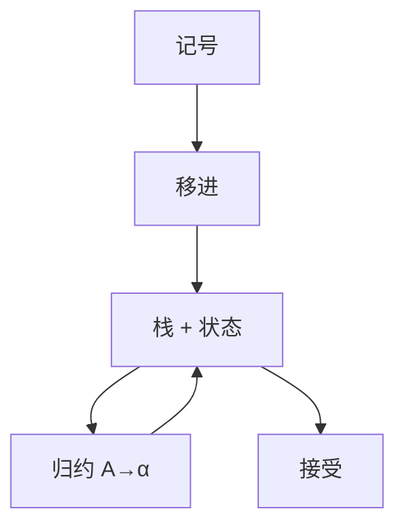

# LR 与移进归约

自底向上：把已识别的右部归约成左端非终结符；移进把下一记号压栈，由项集决定动作。

<footer>—— 据 Knuth, On the Translation of Languages from Left to Right, 1965；龙书第 4 章整理</footer>

上一课[LL 与 FIRST/FOLLOW](/cs/ll-first-follow)给出自上而下预测。许多无二义文法不是 LL(1)：左递归、公共前缀。本课不重算 FIRST。缺口是**移进归约**：栈上放已读前缀对应的项，动作由 DFA（项集规范族）决定。本课钉 LR 的直觉与冲突种类；不手填一张巨大的 SLR 表。

## 问题

最左归约的逆是最右推导。分析器维护栈：移进读记号；当栈顶形成某 $A\to\alpha$ 的 $\alpha$ 且前瞻允许，则弹出 $|\alpha|$ 个符号、压 $A$。何时允许由项 $A\to\beta\cdot\gamma$ 的闭包与转移给出。缺口是这份自底向上的控制，不是再写递归下降。

LR(1) 比 LL(1) 认的语言更广，仍是确定上下文无关语言的实用近全。二义文法（if-else）会移进/归约冲突，用优先级消解是工具习惯，本课承认。

### 项不是产生式的别名

项记录「右部已经看到哪」。闭包把点后非终结符的所有产生式加进来，像 ε 转移。GOTO 是读一个符号后的新项集。这是词法 DFA 在文法上的同类物，状态却是项集。

Knuth 1965 定义 LR($k$)。DeRemer 的 SLR、LALR 是实用弱化。Yacc/bison 用 LALR(1)。本课不把四种表的包含关系证完，只认移进、归约、接受、报错。

## 方法

从增广文法 $S'\to S$ 建项集 DFA。表：动作（移进 $s_i$、归约 $A\to\alpha$、接受）与转移。分析循环查表直到接受或空动作。

SLR 用 FOLLOW 决定归约前瞻，可能冲突；LR(1) 把前瞻编进项。本课只要知道冲突 = 同一状态下移进与归约或两归约争同一记号。

## 机制

左递归对 LR 无妨，这是相对 LL 的实际收益。归约时执行语义动作、建 AST 节点，下一课接。分析仍线性于记号数（表已建好）。表的大小是编译器生成时的代价，不是源程序的渐近。

## 边界

本课不列出全部闭包算法伪代码。不处理 GLR。二义消解规则不是 CFG 的一部分。后课默认：程序语言语法用 LR 族分析器；输出是分析树或直接 AST。抽象语法树丢掉推导里的纯形式节点。

## 小结

- LR = 移进归约 + 项集 DFA；认的语言宽于 LL(1)。
- 冲突是移进/归约或归约/归约。
- 左递归可保留；表在生成期构造。
- 出处：Knuth, 1965；Aho et al., 龙书第 4 章。
