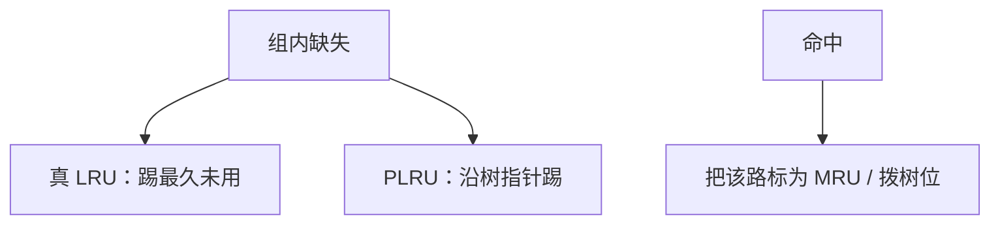

# LRU / PLRU

组相联要在缺失时丢掉「最可能不再用」的那一路；真 LRU 的状态随路数阶乘涨，树状伪 LRU 用少得多的位逼近。

<footer>—— 据 Hennessy and Patterson, CA:AQA；Belady 最优替换的对照 整理</footer>

[上一课](/cs/deep-pipeline-clock) 收束乱序前端，下一条路是存储层次。[局部性](/cs/locality-principle) 已经要求「留下最近用的」。[缺失分类](/cs/cache-miss-types) 把冲突与容量分开。本课不重讲五级的 cache 时序。缺口是**组相联里具体怎么选牺牲者：真 LRU 与工业常用的 PLRU**。

## 问题

直接映射没有替换：索引唯一决定路。2–16 路时，缺失要在组内挑一块踢掉。Belady 的 MIN 需要未来引用，硬件没有。栈算法意义上的 LRU：丢掉最久未访问的那路，对许多访问模式接近 MIN。但 $n$ 路真 LRU 要记 $n!$ 种排列或至少 $n\log n$ 量级的年龄，16 路已经烦。缺口不是更大的 cache，而是**用可实现的位实现「接近 LRU」**。

PLRU：满二叉树，每个内节点一位指向「更 LRU 的一侧」。命中把路径拨向对方；替换沿指针走到叶子。位数是 $n-1$。

## 方法

真 LRU：组内维护年龄链或时间戳，命中则提到 MRU，替换踢 LRU。PLRU：命中沿根到该路把各位翻成「另一侧更老」；替换从根跟随「老侧」指针。随机/轮转更便宜，冲突模式下更差。

写回 cache：被踢的若脏则先写回，替换延迟叠在缺失上。

## 机制

冲突缺失对 LRU 敏感：循环扫描刚好大于组的工作集时，LRU 会系统性踢「即将再用」的块（scan 颠簸）。这是下一课 RRIP 要打的点，本课只承认 LRU 不是万能。PLRU 在真 LRU 与随机之间：大多数 SPECint 差距小，实现频率更好。

与 [VIPT](/cs/vipt-cache) 无关：替换发生在命中/缺失判定之后，用的是物理标签那一组。

## 边界

本课不引入 RRIP 的 SRRIP/BRRIP，下一课。也不把操作系统的页面 LRU 与 cache 行 LRU 写成同一个结构——页替换是 OS 课，虽然栈直觉相同。预取填入该标成 MRU 还是 LRU，影响污染，是预取课。

后课默认：组相联默认 PLRU 或真 LRU；扫描式工作集会打穿 LRU。再引用间隔预测是下一课。

## 小结

- 真 LRU 逼近 Belady，路多则用 PLRU 降位数。
- 扫描访问让 LRU 颠簸，这是 RRIP 的动机。
- 出处：Hennessy and Patterson, *CA:AQA*；Belady MIN。
