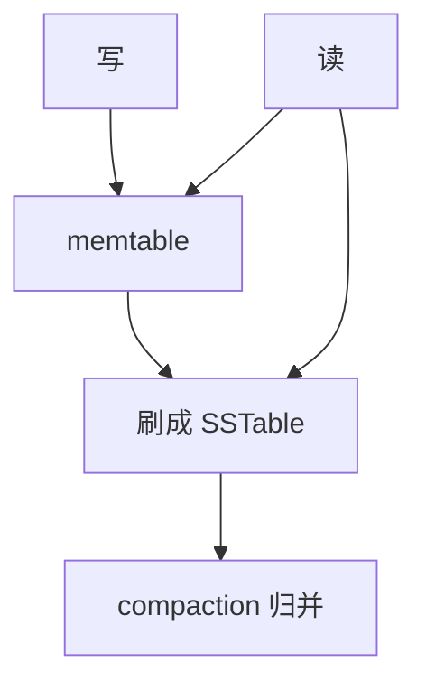

# LSM 与 compaction

先写内存表再刷成不可变文件；compaction 把多层文件归并，用顺序写换读时的多层查找。

<footer>—— 据 O'Neil, Cheng, Gawlick and O'Neil, The Log-Structured Merge-Tree, Acta Informatica 1996；Google Bigtable；RocksDB</footer>

[上一课](/cs/art-index-db)给主存有序树。本课不升级 Node48。缺口是写多读少或写吞吐优先：B+ 原地更新造成随机写与页分裂。日志结构归并树（LSM）把写入变成追加：memtable 满则 freeze 成 SSTable（有序文件），后台 compaction 归并重叠键。

## 问题

随机写 SSD 也有放大与写寿命。LSM：插入/更新/删除（墓碑）进 memtable（可用跳表或 ART）；刷盘后文件不可变，简化并发（写不改旧文件）。读必须查 memtable + 各层文件，直到找到最新版本。缺口是 **compaction 策略**决定写放大、读放大、空间放大——下一课读放大与布隆，再下一课 leveled vs tiered。

崩溃：WAL 保护尚未刷盘的 memtable，与主干 WAL 同构，粒度是应用日志。检查点即「哪些文件是当前版本」。

O'Neil et al. 1996 LSM。Bigtable / LevelDB / RocksDB 是工程谱系。本课机制，RocksDB 产品课在数据模型族再讲。

## 方法

Level-0：新刷的文件可重叠。更高层：compaction 挑选重叠文件归并输出。墓碑要保留到能证明更下层无旧值才丢。快照/MVCC：compaction 不能丢掉仍被快照看见的版本——与后课 MVCC GC 接口。

节流：compaction 跟不上则写停顿（write stall）。这是 LSM 的运维不变式，不是偶发。

## 机制

顺序写带宽高，代价是读走多文件、写同一键多次（每层一次）。B+ 读放大低、写随机。选择是工作负载，不是谁淘汰谁。延迟物化、列存可叠在 SST 内部格式上（后课 Parquet 是分析侧亲戚）。

并行：多 compaction 工人，注意与缓冲池争磁盘。pin-latch 模型变成文件+块缓存。

## 边界

本课不量化布隆如何砍文件。也不把 leveled/tiered 的放大公式写完。全文倒排也可 LSM，后课。

后课默认：写走 memtable+SST+compaction。读放大与布隆：用过滤器避免打开无键文件。

不可变文件让崩溃恢复变成「丢掉未刷 memtable、重放 WAL」，结构修改比 B+ SMO 少。

## 小结

- LSM 用顺序刷盘与归并代替原地更新。
- compaction 是持续税；跟不上则写停顿。
- 读放大与布隆下一课。
- 出处：O'Neil et al. 1996；Bigtable；RocksDB 设计。
