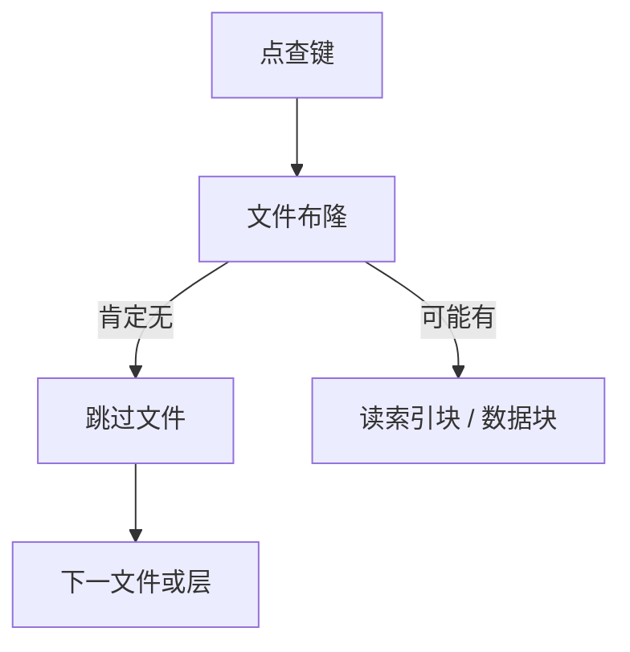

# LSM 读放大与布隆

点查可能打开每一层的文件；布隆过滤器以假阳性换「文件里肯定没有」的跳过，读放大才从层数里降下来。

<footer>—— 据 Bloom, Space/Time Trade-offs in Hash Coding, CACM 1970；LevelDB/RocksDB；O'Neil LSM</footer>

[上一课](/cs/lsm-compaction)画出 memtable 与多层 SST。本课不选 compaction 形状。缺口是读路径：点查最坏触及每层多个文件（L0 重叠）。每文件一次 I/O 甚至一次索引块，放大远大于 B+ 的 $O(\log n)$ 页。布隆过滤器（及 fence 指针、区间）先否定「键不在此文件」。

## 问题

布隆：位图+多哈希，可能假阳性（空跑一次 I/O），无假阴性（说没有就真没有，对集合存在而言）。删除与墓碑：过滤器按文件构建时包含当时键；compaction 重建。缺口是**把过滤器放进文件元数据**，读路径先查内存里的布隆再决定是否读索引块。

范围扫描：布隆帮不上「范围内是否有键」的全体否定（有区间过滤器、prefix bloom 变体）。范围仍要走有序文件的迭代器堆（多路归并各层）。

Bloom 1970。计算机课布隆过滤器已有；本课接到 SST。quotient/cuckoo filter 是替代，点名不展开。假阳性率与位数是空间换 I/O。

## 方法

每个 SST 一块布隆（或按数据块分）。点查：从新到旧层，memtable → L0 各文件 → 更高层至多一个文件（leveled 时）。全 miss 仍可能因假阳性读盘。缓存索引块与布隆本身，避免过滤器也 miss。

统计：优化器对 LSM 表的代价应计期望打开文件数，不是当成堆扫。否则 DP 会误判。

## 机制

写放大与读放大此消彼长：更积极 compaction 减少层与重叠，读变好、写变重。布隆降低读放大但不降层数本身。块缓存命中时「打开文件」可能只是内存比较。

与延迟物化：SST 内部可以是行或列；布隆在键上，不在投影列上。

## 边界

本课不比较 leveled 与 tiered 的公式——下一课。也不把布隆当唯一跳过手段：zone map 在列存分析文件上做范围跳过，后课。

后课默认：LSM 点查先过滤器后数据；范围走多路迭代器。leveled 对 tiered：层内重叠政策不同，放大曲线不同。

假阳性是读放大的残余项，调位数直到 I/O 预算够。

## 小结

- 读放大来自多层与 L0 重叠；布隆跳过无键文件。
- 范围扫描主要靠有序归并，不是布隆。
- leveled 对 tiered 下一课：compaction 形状决定放大。
- 出处：Bloom 1970；O'Neil LSM；LevelDB/RocksDB。
