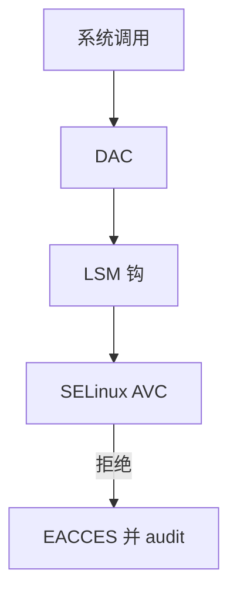

# LSM 与 SELinux

LSM 在 inode、进程、套接字等对象上留钩子；SELinux 用类型强制把「谁能碰谁」写成策略，而不是再加一位 cap。

<footer>—— 据 Wright et al., Linux Security Modules；NSA/SELinux 文档；[xattr](/cs/xattr-acl) 为标签存放先修</footer>

[capabilities](/cs/linux-capabilities) 仍是「能做特权操作吗」。强制访问要问 **这个 httpd 能不能写那个 shadow**。缺口是 LSM 框架与 SELinux 作为实例。

## 问题

钩子：`inode_permission`、`file_open`、`socket_connect`… 多个 LSM 可叠（新内核）。SELinux：类型、域转换、`security.*` xattr。缺口：策略语言不是本课作业；Permissive vs Enforcing；与 [overlay](/cs/overlayfs) 标签 copy-up。本课不写如何破解 SELinux。

AppArmor 下一课用路径。SELinux 用类型，与 inode 绑定更紧。audit 后课记拒绝。

## 方法

打开文件：VFS 权限 → LSM 钩 → SELinux 查 AVC 缓存。对照 [netfilter](/cs/netfilter-conntrack)：一个管包，一个管对象标签。对照 ASan：一个防内存 bug，一个防越权。对照 FUSE：用户 FS 也要过钩。

## 机制

LSM 让强制策略成为内核可插层，SELinux 把系统做成类型图。它不替代补丁。不要写成合规广告。与 [KPTI](/cs/kpti-os)：正交。与容器：需正确 label 与类别。

策略错误会拒绝合法服务，看起来像权限 bug。

实现上：AVC 缓存命中才快，首次决策要走策略。域转换在 exec 时发生，httpd 的子进程类型由策略决定。Permissive 只记不拦，容易误以为已经保护。 读法上只引用[上一课](/cs/linux-capabilities)的结论，不把对象换成训练推理或限价簿。

本课在操作系统进阶的「安全、启动与调试 / 内核安全与启动」课序里，对象是 **LSM 与 SELinux**。

- 先修只引用，不重导：上一课的结论当公理，本课只补差。
- 五栏不吞并：不把本课写成大模型训练/推理，也不写成限价簿或权重量化。
- 文献用 OSTEP、McKusick、内核文档与具名会议论文；不发明 arXiv 编号。

## 边界

本课不引入 MLS 等级的全部。不保证微内核的同构。下一课路径强制：AppArmor。

版本字段会变，课序钉的是机制对象「LSM 与 SELinux」，不是某一主线内核的结构体名。
后课默认：对象可打类型，钩子强制。按路径的 MAC，下一课 AppArmor。

## 小结

- LSM 提供钩；SELinux 用类型强制。
- 标签常在 xattr；拒绝进 audit。
- AppArmor 是下一课。
- 出处：Wright LSM；SELinux；Linux security。
