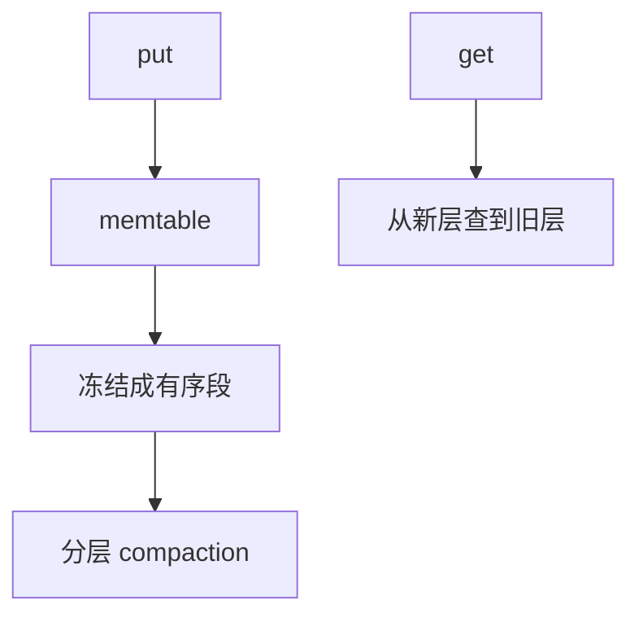

# LSM 树作为结构

内存表写满则冻结刷成有序段；段按层合并，读时从新到旧查直到命中。写变顺序 I/O，读付放大。

<footer>—— 据 O'Neil, Cheng, Gawlick and O'Neil, The Log-Structured Merge-Tree, Acta Informatica 1996；[WAL](/cs/wal) 课序中的日志思想整理</footer>

[上一课](/cs/cache-oblivious) 优化未知 $B$ 的读布局。更新密集时原地 B 树随机写贵。[WAL](/cs/wal) 已说明先日志。[B+ 分裂](/cs/bplus-split) 是原地页改。本课不重讲事务。缺口是把 LSM **当成字典结构**：memtable + 不可变 SSTable 层。

## 问题

`put` 很高、`get` 可接受延迟。LSM：插入进内存有序表（树或跳表）；满则刷盘成有序文件。读：先 memtable，再各层，用布隆跳过文件。[布隆](/cs/bloom-filter) 在此当过滤器，不是本课新发明。合并（compaction）把多层归并，消墓碑。缺口是**用追加与归并代替原地裂页**，代价从写放大、读放大、空间放大三维写合同。

O'Neil et al., *Acta Informatica*, 1996。本课停在结构；不重写某引擎调参百科，不进入 LOB。

## 方法

层容量比 $T$：第 $i$ 层 $\sim T^i$。leveled vs tiered 合并策略改变放大。墓碑删除：直到合并到含旧值的层才真正消失。与[商过滤器](/cs/quotient-filter) 可作层内索引，点名。

与路径复制：磁盘段不可变，同「旧版本共享」；memtable 可变。与缓存无关：LSM 参数 $T$ 显式。

## 机制

点查最坏碰多层，故 Bloom 与索引块。范围扫描要归并多路迭代器。本课是 CS 结构，不把云厂商产品名当算法。

无锁内存队列下一课回到共享内存，不刷盘。

## 边界

本课不把 RocksDB 调参当正文。不把 LSM 写成量化存储。并发内存字典用哈希表/跳表，CAS 队列另讲。

后课默认：写优化外存映射可用 LSM。无锁 FIFO 用 Michael–Scott 队列。

## 小结

- LSM：内存表 + 不可变有序段 + 合并。
- 写顺序化，读/写/空间放大互换。
- 下一课共享内存无锁队列。
- 出处：O'Neil, Cheng, Gawlick and O'Neil, 1996。
