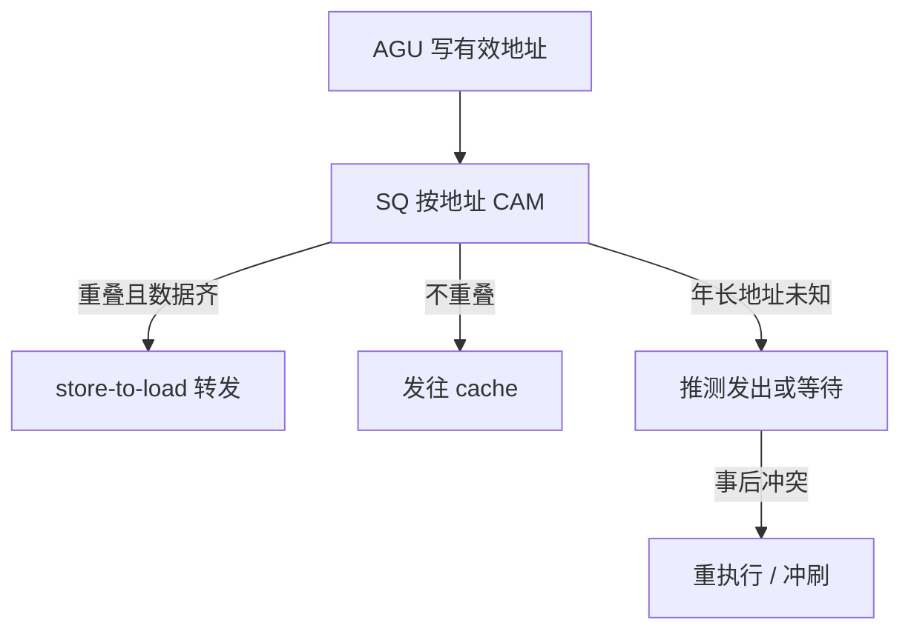

# load / store 队列与内存消歧

寄存器重命名消掉假相关；两条访存是否撞同一地址，要等有效地址算完才知道。队列把未提交的 store 托住，load 在里面搜转发。

<footer>—— 据 Chao, Breach, and Shen；Hennessy and Patterson, CA:AQA 整理</footer>

[上一课](/cs/issue-queue-wakeup)让 ALU 按物理寄存器就绪发射。load/store 的操作数可以齐了，**地址还没算**；即使算了，年轻 load 与年长 store 是否别名也未知。本课不重讲 IQ 选择。缺口是**内存消歧**：在不知道地址时如何（或不如何）让 load 提前，以及 store 如何在提交前对 cache 不可见。

## 问题

`store x1, 0(x2)` 后面的 `load x3, 0(x4)`：若 `x2==x4`，load 必须拿到 store 的数据（或等它提交后从 cache 读）；若地址不同，load 可以去 cache。地址在 AGU 之后才有，比寄存器 RAW 晚一截。缺口不是再加物理寄存器，而是**按程序序排好的 load 队列与 store 队列，用地址比较做转发或让路**。

store 在 ROB 提交前只存在于 store queue；提交才写 cache，才能被 [MESI](/cs/mesi-protocol) 看见。这与推测恢复一致。

## 方法

译码时 load/store 按序进入 LQ/SQ。AGU 写回有效地址后：

- load 在 SQ 里搜年长、地址重叠的 store：命中则转发数据（可能只要部分字节）；若年长 store 地址未就绪，则要么等，要么推测「不冲突」并发出 cache 请求。
- 若后来发现冲突，replay load 并冲刷依赖（或只重执行该 load）。

## 机制

消歧失败有两类代价：等（损失 ILP）和猜错（replay，类似误预测但通常更局部）。多核下，转发只看见本核 SQ；他核的 store 靠一致性事务，不在 SQ 里。字节重叠、非对齐、向量宽 load 让 CAM 匹配变成区间重叠，而不是 64 位相等。

与 [ROB](/cs/ooo-rob)：LQ/SQ 项数是窗口的第四个上限，常比 PRF 先满。

## 边界

本课不引入存储集：那是用 PC 预测「会不会撞」，把「等未知地址」变成可学习的事，下一课。也不把 x86 的 store forwarding 对齐限制写成通用 ISA。原子 RMW 的队列行为是一致性进阶课。

后课默认：load 可以在年长 store 地址未知时推测发出；冲突则 replay。用历史预测依赖，是下一课存储集。

## 小结

- LQ/SQ 按程序序托住访存；地址 CAM 做转发或放行。
- 地址未知时只能等或推测；猜错要 replay。
- 用 PC 预测依赖对是下一课存储集。
- 出处：Hennessy and Patterson, *CA:AQA*；乱序访存队列的经典实现传统。
