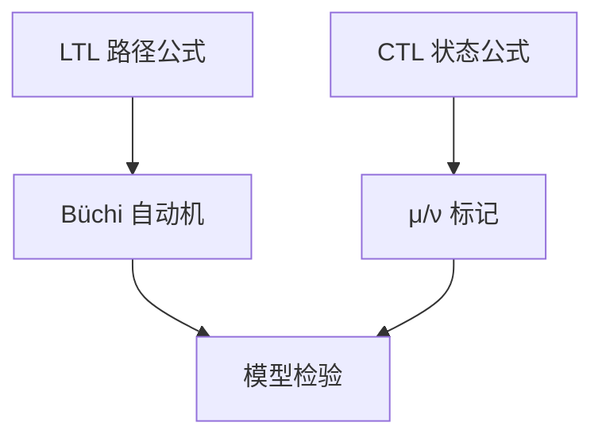

# 时序逻辑 LTL / CTL

LTL 谈路径上的 $\mathrm{G},\mathrm{F},\mathrm{U}$；CTL 在状态上带路径量词 $\mathrm{A},\mathrm{E}$。二者不可比，CTL* 合起来。模型检验算法因此分家。

<footer>—— 据 Pnueli, 1977；Clarke and Emerson；Baier and Katoen 整理</footer>

上一课[模型检验](/cs/model-checking) 有流程无性质语言。缺口是 **LTL 与 CTL**。安全 $\mathrm{G}\neg\mathrm{bad}$、活性 $\mathrm{GF}\mathrm{progress}$。本课钉算子与表达力差，不写自动机表全文。

## 问题

LTL：公式在无穷路径上解释。$\mathrm{X}\varphi$ 下一状态，$\varphi\mathrm{U}\psi$ until，$\mathrm{F}=\top\mathrm{U}$，$\mathrm{G}=\neg\mathrm{F}\neg$。系统满足 $\varphi$：从初态出发**所有**路径满足（或带公平）。CTL：状态公式，$\mathrm{EX},\mathrm{EG},\mathrm{EU},\mathrm{AX},\ldots$——先量词后时序。$\mathrm{AF AG}p$ 与 $\mathrm{AGF}p$ 一类不可互译。线性 vs 分支。

LTL 检验：公式 $\to$ Büchi 自动机，与系统同步，空性。PSPACE 完全。CTL：多项式于 $|M|\times|\varphi|$ 的标记算法，用 $\mu/\nu$。

### 不是「G 就是 always 英语」

没有量词的 LTL 仍隐含「所有路径」。CTL 的 $\mathrm{EF}$ 是存在路径。写错量词会把安全写成活性。

Pnueli 1977 LTL。Emerson–Clarke CTL。Baier–Katoen 第 5–6 章。Vardi–Wolper 自动机方法。本课不证表达力全部分离。

## 方法

用互斥：$\mathrm{G}\neg(c_1\land c_2)$ 安全；$\mathrm{G}(try\to\mathrm{F}crit)$ 活性。指出公平性：无公平则「永远不调度」是合法路径。对照 Hoare：安全可用不变式；活性要用变式或 $\mathrm{F}$。

## 机制

性质语言选定之后，工具链分叉。工业上 LTL 常见（断言风格）；硬件 CTL/ACTL。CTL* 更贵。本课只要：写性质时先选线性还是分支。

[正则](/cs/alphabet-language) 是有限串；这里无穷词，ω-正则。泵引理不直接搬。

LTL 不能说「存在一条路径始终避免死锁且另一条……」那种分支比较；CTL 不能说「沿同一路径 $p$ 直到 $q$ 且中间无限常 $r$」的某些线性组合。CTL* 两者都收，检验更贵。$\omega$-正则捕获 LTL；正则语言课的有限串泵引理不适用无穷词，另有无穷泵，本课不写。

## 边界

本课不写嵌套 until 的全部等价，不引入 MTL 实时。不把 STL 信号时序当主线。后课默认：安全 $\mathrm{G}$、活性 $\mathrm{F}/\mathrm{GF}$；LTL 与 CTL 不可互换。下一课 SAT 引擎：DPLL/CDCL。

安全用 $\mathrm{G}$，活性用 $\mathrm{F}/\mathrm{GF}$，公平性必须写进模型或公式。LTL 走 Büchi，CTL 走标记不动点，二者表达力不可比。有界展开把路径交给 SAT，下一课引擎。

## 小结

- LTL：路径上 G/F/U；CTL：状态上 A/E + 时序。
- 检验：Büchi 空性 vs 标记不动点。
- 公平性是活性的一部分，须声明。
- 出处：Pnueli, 1977；Clarke and Emerson；Baier and Katoen。
