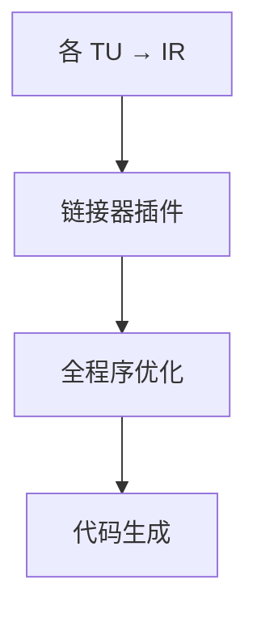

# LTO

链接期优化把多个编译单元的 IR 放到一起，得到全程序调用图与内联，而不要求源文件合成一份翻译单元。

<footer>—— 据 Glek and Hubička, Optimizing real-world applications with GCC LTO；LLVM LTO/ThinLTO；龙书过程间优化整理</footer>

上一课[PGO](/cs/pgo)给热度，但单 TU 看不见其它 `.c` 的函数体。缺口是 **LTO**：编译器吐 IR 位码，链接器调优化器再代码生成。ThinLTO：摘要先行、并行后端，减内存。本课钉工作流，不写 ELF 节布局——链接课序。

## 问题

C 的分别编译使 `static` 小函数跨文件无法内联，虚调用目标不全。LTO：全程序（或近全）IR。缺口是**何时优化、谁当链接器插件**，不是 PGO 插桩。

代价：内存、时间、增量编译失效。ThinLTO 用函数摘要+导入热 callee 近似全 LTO。

### LTO 不是「把 .c 都 `#include` 在一起」

语言规则仍按 TU 看名字内部链接；LTO 在 IR 级合并。宏与 `static` 的身份按符号，不是文本粘贴。

GCC LTO。LLVM gold/lld 插件。ThinLTO（Johnson et al.）。本课不写 fat LTO 对象的全部格式。

## 方法

`clang -flto`：`.o` 里是 bitcode。`lld` 调 `lto`：合并、内联、IPSCCP、DCE 无用全局、再分发后端。与 PGO：先 LTO 插桩或 IR 级轮廓。

与[调用图](/cs/interprocedural-callgraph)：LTO 才有闭世界（静态链接）。动态库边界仍开。

## 机制

符号可见性：被其它 `.so` 用的符号不能删、不能改约定。`hidden`/`internal` 使 DCE 更狠。不要 LTO 进不兼容的 IR 版本。

并行：ThinLTO 两阶段，摘要全局，优化仍分片。

## 边界

本课不写链接脚本。后课默认：跨 TU 内联与 DCE 靠 LTO。下一课 UB：全程序分析更敢删「不可能」路径，风险也更大。

也不把 LTO 当 Java 的 JIT 全程序（那是运行时）。

## 小结

- LTO：链接时优化 IR，补全程序视野。
- ThinLTO 用摘要换可扩展性。
- 可见性与 `.so` 边界限制闭世界。
- 出处：Glek and Hubička；LLVM LTO/ThinLTO；对照龙书 IPO。
