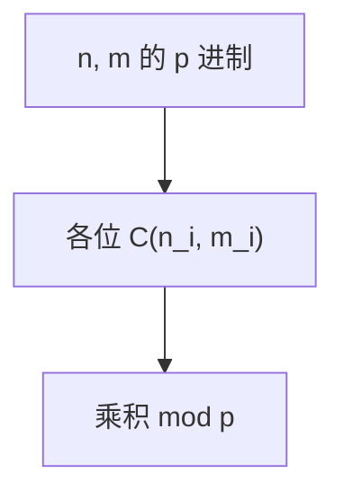

# Lucas 定理

素数 $p$ 下，$\binom{n}{m}\equiv\prod\binom{n_i}{m_i}\pmod p$，其中 $n_i,m_i$ 是 $p$ 进制数字；某位 $n_i<m_i$ 则组合数为 0。

<footer>—— 据 Lucas, Sur les congruences des nombres eulériens, 1878；初等数论教材整理</footer>

上一课[Pollard rho](/cs/pollard-rho)分解 $n$。组合数 $\binom{n}{m}\bmod p$ 在 $n$ 大、$p$ 小素数时，不能先算阶乘。缺口是 Lucas：拆 $p$ 进制。不重写 $\varphi$。后课生成函数用形式幂级数，本课只要模 $p$ 组合数。

## 问题

$n=\sum n_i p^i$，$m=\sum m_i p^i$，$0\le n_i,m_i<p$。Lucas：$\binom{n}{m}\equiv\prod_i\binom{n_i}{m_i}\pmod p$。每位 $\binom{n_i}{m_i}$ 可 $O(p)$ 或预处理阶乘表 $O(p)$。$n_i<m_i$ 则该位 0，整体 0。

缺口是进制拆，不是 Lucas 数列（同名不同）。模 $p^k$ 要用更高（Kummer、Lucas 推广），本课点名。

### 不是中国剩余定理本身

模合数 $M=\prod p_i^{k}$ 时，对每个 $p^k$ 算组合数再 CRT。$k=1$ 用本课；$k>1$ 更重。不要只 Lucas 再 CRT 到 $p^2$。

Lucas 1878。Kummer 进位次数给 $p$ 进赋值。后课生成函数 $\sum\binom n k x^k=(1+x)^n$ 在形式幂级数，不取模。

## 方法

写 $n,m$ 的 $p$ 进制。预处理 $0..p-1$ 的阶乘与逆元（[扩欧](/cs/euclid-extended)）。逐位乘。$p$ 不大。

$p$ 合数不能直接 Lucas。

## 机制

$(1+x)^n=\prod(1+x)^{n_i p^i}$，而 $(1+x)^{p^i}\equiv 1+x^{p^i}\pmod p$（新鲜人的梦），展开对应各位独立选。与筛法无关。与 NTT：都用模 $p$，对象不同。

## 边界

本课不写 $q$-Lucas。不写大 $p$ 的卢卡斯数列判素性（Lucas–Lehmer 是梅森数）。后课默认：$\binom n m\bmod p$ 用 Lucas（$p$ 小）。下一课生成函数。

## 小结

- 组合数模素数拆成各位小组合数。
- 某位不够则 0。
- 模素数幂要另法。
- 出处：Lucas, 1878。
