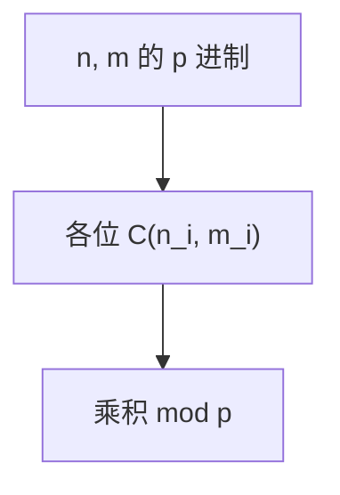
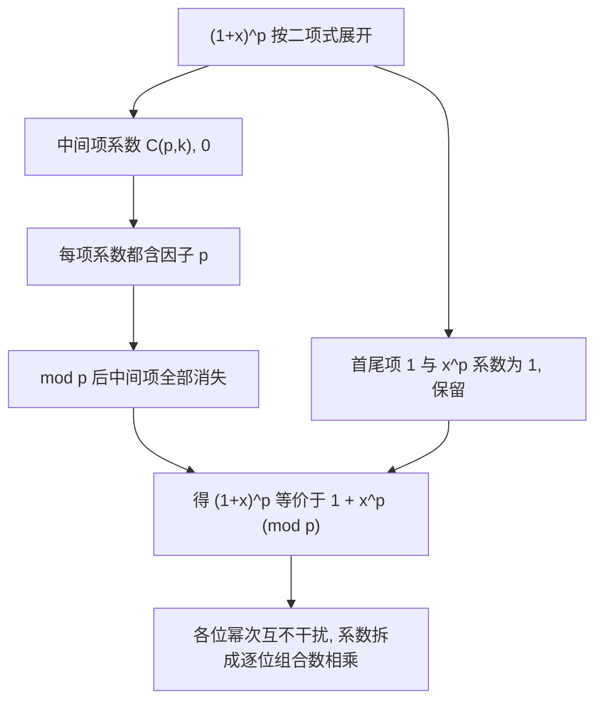

# Lucas 定理

素数 $p$ 下，$\binom{n}{m}\equiv\prod\binom{n_i}{m_i}\pmod p$，其中 $n_i,m_i$ 是 $p$ 进制数字；某位 $n_i\lt m_i$ 则组合数为 0。

<footer>—— 据 Lucas, Sur les congruences des nombres eulériens, 1878；初等数论教材整理</footer>

上一课[Pollard rho](/cs/pollard-rho)管分解。现在要算 $\binom{n}{m}\bmod p$，$n$ 巨大、$p$ 是小素数：先算阶乘再除这条路直接死掉——$n\ge p$ 时 $n!$ 已含因子 $p$，模下恒为 $0$。缺口是 Lucas：把 $n,m$ 拆成 $p$ 进制逐位处理。本课不重写 $\varphi$；后课生成函数用形式幂级数，这里只要模 $p$ 组合数。

## 问题

$n=\sum n_i p^i$，$m=\sum m_i p^i$，$0\le n_i,m_i\lt p$。Lucas：$\binom{n}{m}\equiv\prod_i\binom{n_i}{m_i}\pmod p$。每位 $\binom{n_i}{m_i}$ 可 $O(p)$ 或预处理阶乘表 $O(p)$。$n_i\lt m_i$ 则该位 0，整体 0。

缺口是进制拆分，不是 Lucas 数列——同名不同物。模 $p^k$ 要用更强的推广（Kummer 定理、广义 Lucas），本课点名即可。

数字实例：$p=3$，$n=13$，$m=5$。$13=(111)_3$，$5=(012)_3$，于是 $\binom{13}{5}\equiv\binom{1}{0}\binom{1}{1}\binom{1}{2}\equiv 1\times 1\times 0=0\pmod 3$——最低位 $1\lt 2$ 不够拿，整体归零，连乘都不用算完。

### 不是中国剩余定理本身

模合数 $M=\prod p_i^{k}$ 时，思路是对每个素数幂 $p_i^k$ 分别算组合数，再用 CRT 合并；$k=1$ 用本课，$k\gt 1$ 需要素数幂版本。不能只对 $p$ 用 Lucas 就 CRT 到 $p^2$：模 $p$ 的余数不决定模 $p^2$ 的余数，信息不够。

Lucas 1878。Kummer 进位次数给 $p$ 进赋值。后课生成函数 $\sum\binom n k x^k=(1+x)^n$ 在形式幂级数，不取模。

## 方法

步骤：写出 $n,m$ 的 $p$ 进制表示；预处理 $0..p-1$ 的阶乘与逆元（逆元用[扩欧](/cs/euclid-extended)求）；对每位算 $\binom{n_i}{m_i}$ 后连乘取模。整套流程要求 $p$ 不大，预处理 $O(p)$ 才划算。

```mermaid
flowchart TD
  NM["n, m 的 p 进制"] --> BIN["各位 C(n_i, m_i)"]
  BIN --> MOD["乘积 mod p"]
```

$p$ 是合数时不能直接 Lucas：模下不是域，逆元未必存在，逐位独立性也随之失效。

术语翻译：「预处理阶乘与逆元」就是提前把 $0!$ 到 $(p-1)!$ 及其模逆一次性算好存表，之后每位查表 $O(1)$。这也意味着 Lucas 天生为小素数设计——$p$ 到 $10^9$ 量级时表根本存不下，逐位现算就太慢了。

## 机制

机制在生成函数这边：$(1+x)^n=\prod_i(1+x)^{n_i p^i}$，而 $(1+x)^{p^i}\equiv 1+x^{p^i}\pmod p$——中间各次项的系数全带因子 $p$，模下消失，这就是所谓「新鲜人的梦」。于是 $x^m$ 的系数只能由各位独立贡献，逐位组合数相乘。它与筛法无关；与 NTT 只是共用模 $p$ 运算，处理的对象不同。

```mermaid
flowchart TD
  EXP["(1+x)^p 按二项式展开"] --> MID["中间项系数 C(p,k), 0<k<p"]
  MID --> DIV["每项系数都含因子 p"]
  DIV --> VAN["mod p 后中间项全部消失"]
  EXP --> KEEP["首尾项 1 与 x^p 系数为 1, 保留"]
  VAN --> RES["得 (1+x)^p 等价于 1 + x^p (mod p)"]
  KEEP --> RES
  RES --> IND["各位幂次互不干扰, 系数拆成逐位组合数相乘"]
```

直觉类比：「新鲜人的梦」像一张表格每个中间格都被塞了一份因子 $p$，模 $p$ 一取，中间格子集体清零，只剩首尾两格活着。正是这批中间项的消失保证了各位互不串扰，Lucas 的逐位相乘才有合法性。

## 边界

本课不写 $q$-Lucas，也不写大 $p$ 的 Lucas 数列判素性——Lucas–Lehmer 定理处理的是梅森数，另一族对象。后课默认：$p$ 小时 $\binom n m\bmod p$ 用 Lucas。下一课生成函数。

## 小结

- 组合数模素数拆成各位小组合数。
- 某位不够则 0。
- 模素数幂要另法。
- 出处：Lucas, 1878。
