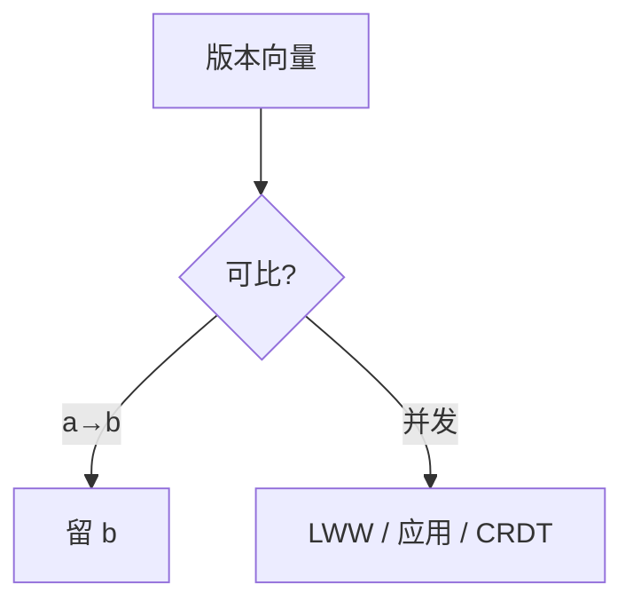

# LWW 与冲突

Last-Writer-Wins 用时间戳全序强行打结。并发写里有一侧被丢，收敛很快，语义可能错。

<footer>—— 据 DeCandia et al., Dynamo, SOSP 2007；Johnson and Thomas, RFC 677, 1975 的时间戳副本整理</footer>

上一课[Dynamo](/cs/dynamo-anti-entropy)用向量时钟**检出**并发。缺口是**打结**：检出之后系统必须给出一个值。最便宜的规则是比较时间戳，大者赢。本课说明它丢什么，不把 CRDT 的交换幂等提前当解药全文。后课 CRDT 从「不要丢」再起。

## 问题

两写不可比（向量不可比），但存储只要一个 blob。LWW：取墙钟或 HLC 或 Lamport 标量较大者，删另一份。收敛：是，所有副本终见同一时间戳。正确：若两次写是「购物车加不同商品」，丢掉一侧等于丢商品。若写是覆盖型配置，后写覆盖可能正是意图——但「后」在并发下是假的，只是钟大。

Johnson–Thomas 已用时间戳副本。Dynamo 论文明确让应用合并购物车，而不是默默 LWW。许多数据库默认 LWW 是因为实现十行。

墙钟 LWW 在 $\varepsilon$ 内是随机丢。HLC 尊重因果：$a\to b$ 则 $b$ 赢；并发仍按 $l,c$ 假全序丢一边。

## 方法

策略分层：能比因果则因果后继覆盖前驱；仅并发才进入冲突处理。处理菜单：LWW、保留多版本交应用、自动合并函数。选 LWW 必须声明「值是可覆盖标量，丢并发写可接受」。

读修复与反熵必须使用同一比较器，否则一边 LWW 一边保留多版本，会振荡。

## 机制

丢失更新：两个计数器 +1 变成 +1。这与单机丢失更新同构，只是用钟当锁。要计数应对 CRDT 或进共识。LWW 对「最后配置赢」类对象：仍可能把管理员的写丢掉，若另一副本钟快。运维看到的「数据丢了」常常是 LWW 而不是磁盘。

与[线性一致](/cs/linearizability)：LWW 多主没有线性化点。与因果：LWW 用全序扩展消灭并发，看起来像顺序，其实是任意扩展，不是 Lamport 顺序一致（因为没有单一全局操作序被所有人同意事先，只是比较器事后）。

本课不把 Git merge 当 LWW：三路合并保留分叉。也不写限价簿成交价谁赢。

## 边界

本课不给出半格定理，不写 JSON 自动 merge 的全部坑。后课默认：无声明的「自动冲突解决」按 LWW 理解并假定可丢更新；要保留并发意图用 CRDT 或应用合并。会话保证不修复 LWW 丢值。

打结规则是规格的一部分。只写「最终一致」而默默 LWW，是把安全藏进实现。

## 小结

- LWW 用全序消并发，收敛且可能丢更新。
- 因果可比时应用后继覆盖；LWW 只该打真并发。
- 计数、集合并等意图不能靠 LWW。
- 出处：Dynamo, SOSP 2007；Johnson and Thomas 时间戳副本。
