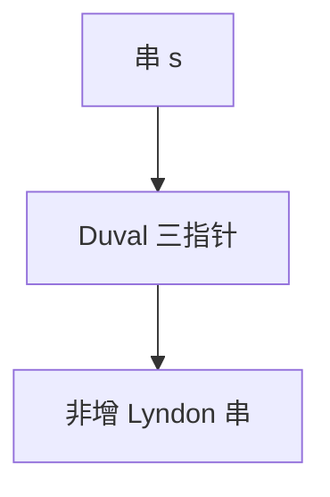

# Lyndon 分解

Lyndon 字严格小于其所有真后缀；每个串唯一分解成非增的 Lyndon 字串联，Duval 线性算出。

<footer>—— 据 Chen, Fox and Lyndon, 1958；Duval, Factorizing Words over an Ordered Alphabet, 1983 整理</footer>

上一课[后缀数组的应用](/cs/suffix-array-applications)能取最小后缀。Lyndon 字：本原且字典序最小的旋转（等价：小于所有真后缀）。缺口是 Duval 分解：把 $s$ 写成 $\ell_1\ge \ell_2\ge\cdots$ 的 Lyndon 串。与最小表示：一个 Lyndon 的最小表示是自身。不重写 SA。后课正则回溯。

## 问题

Duval：三个指针扫，比较当前候选 Lyndon。线性。应用：最小表示（最长 Lyndon 前缀相关）、最长 Lyndon 前缀、与 KMP 的 border 关系点名。

缺口是分解唯一性（Chen–Fox–Lyndon 定理），不是 SA 排序。

### 不是随便的因子分解

Lyndon 分解对给定字母序唯一。换序则变。不要与质因子分解混名。

CFL 定理 1958。Duval 1983 线性算法。后课正则是语言匹配，不是字的 Lyndon。

## 方法

Duval 实现（标准三指针）。输出切点。最小旋转：对 $s+s$ 做 Lyndon 或用前课双指针。

字母必须全序。

## 机制

Lyndon 的真后缀都更大，故拼接非增时字典序结构良。Duval 类似最小表示的跳跃。与 SA：最长 Lyndon 后缀等可用 SA，但分解本身线性不必 SA。

## 边界

本课不写项链多项式。不写 bi-infinite。后课默认：Lyndon 分解线性 Duval。下一课正则匹配与回溯爆炸。

## 小结

- Lyndon 字小于真后缀；分解唯一非增。
- Duval $O(n)$。
- 与最小表示、SA 接口，本课要分解。
- 出处：Chen, Fox and Lyndon, 1958；Duval, 1983。
