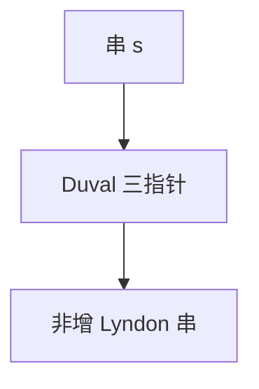
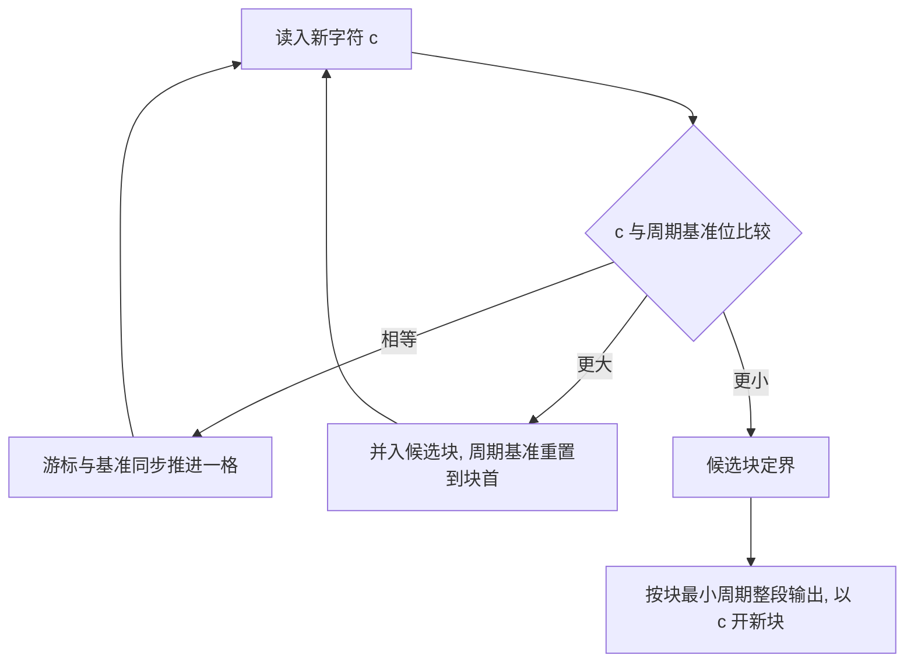

# Lyndon 分解

Lyndon 字严格小于其所有真后缀；每个串唯一分解成非增的 Lyndon 字串联，Duval 线性算出。

<footer>—— 据 Chen, Fox and Lyndon, 1958；Duval, Factorizing Words over an Ordered Alphabet, 1983 整理</footer>

上一课[后缀数组的应用](/cs/suffix-array-applications)能取最小后缀，本课换分解视角：Lyndon 字——本原且字典序最小的旋转（等价：严格小于所有真后缀）。缺口是 Duval 分解：把 $s$ 写成 $\ell_1\ge \ell_2\ge\cdots$ 的 Lyndon 串串联。与最小表示：一个 Lyndon 字的最小表示是自身。不重写 SA。后课正则回溯。

## 问题

Duval 三个指针一趟扫完：候选块起点、块内游标、周期基准，逐位比较决定当前候选 Lyndon 块的去留——字符相等就推进，更大就把新字符吸收进块，更小则块定界、按其周期整段输出。每个字符进出候选块常数次，线性。应用：最小表示（最长 Lyndon 前缀相关）、最长 Lyndon 前缀、与 KMP 的 border 关系点名。

缺口是分解唯一性（Chen–Fox–Lyndon 定理），不是 SA 排序。

### 不是随便的因子分解

唯一性是对给定字母序说的：换一个序，同一串的分解就不同——算法动手前必须先钉死序。也不要与数的质因子分解混名，「因子」在这里没有乘法结构。

CFL 定理 1958。Duval 1983 线性算法。后课正则是语言匹配，不是字的 Lyndon。

直觉类比：「Lyndon 字」像一串珠子围成环，从哪颗开始读都行，Lyndon 字是「从头读最小」的那串，且不是由更小的串重复而成。例如 "aab" 的三个旋转 aab、aba、baa 里它自己最小，是 Lyndon 字；"abab" 虽也是最小旋转，却由 "ab" 重复而成，不本原，不算。

## 方法

Duval 用标准三指针实现，输出每个块的切点。最小旋转：对 $s+s$ 做 Lyndon 分解、取跨过拼接缝（位置 $n$）的那个因子的起点，或直接用前课双指针。前提是字母必须全序——字典序没有定义，一切都无从谈起。

```mermaid
flowchart TD
  S["串 s"] --> DUV["Duval 三指针"]
  DUV --> LYN["非增 Lyndon 串"]
```

字母必须全序。

数字实例："banana" 按标准字母序分解为 "b"、"an"、"an"、"a" 四块——"b" $\gt$ "an"，块序列非增，每块各自是 Lyndon 字。注意方向别搞混：块与块之间要求「前不小于后」，块内部却要求整串小于自己的每个真后缀。

## 机制

Lyndon 字的真后缀都更大，所以非增拼接后的整串周期与字典序结构良态：串的最小周期落在某个分解块的整周期处，分解因此成为字符串周期理论的基座。Duval 的跳跃与最小表示法同型——已经比较出的结论不重做，这是线性的来源。与 SA 接口：最长 Lyndon 后缀一类的量可以问后缀数组，但分解本身 Duval 线性即可，不必建 SA。

```mermaid
flowchart TD
  CMP["读入新字符 c"] --> BR{"c 与周期基准位比较"}
  BR -->|"相等"| ADV["游标与基准同步推进一格"]
  BR -->|"更大"| ABS["并入候选块, 周期基准重置到块首"]
  BR -->|"更小"| CUT["候选块定界"]
  CUT --> OUT["按块最小周期整段输出, 以 c 开新块"]
  ADV --> CMP
  ABS --> CMP
```

为什么是线性：相等或更大时，周期基准已经「预付」了信息——游标沿周期跳过去的安全性与块首一致，不必重比。每个字符最多被吸收、被切块各常数次，均摊 $O(1)$；若每次冲突都从块首重比，就退化成平方。

## 边界

本课不写项链多项式，不写 bi-infinite 序列的组合学。后课默认：Lyndon 分解线性、Duval 即标准实现。下一课正则匹配与回溯爆炸。

## 小结

- Lyndon 字小于真后缀；分解唯一非增。
- Duval $O(n)$。
- 与最小表示、SA 接口，本课要分解。
- 出处：Chen, Fox and Lyndon, 1958；Duval, 1983。
