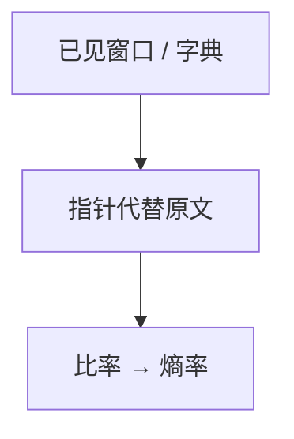

# LZ77 / LZ78

用已见过的子串当字典指针，不显式估计 $p$；对遍历性信源，码长比率几乎必然趋向熵率。

<footer>—— 据 Ziv and Lempel, 1977, 1978；Cover and Thomas 整理</footer>

上一课[算术编码](/cs/arithmetic-coding) 仍要模型 $p$。缺口是**通用压缩**：LZ77 滑动窗口指针，LZ78 显式建字典。实践中的 gzip / zlib / GIF 落在这一族。不重写区间。

## 问题

LZ77：输出 $(距离, 长度, 下一字符)$，指向窗口内最长匹配。LZ78：逐步把未见短语插入字典，输出 $(索引, 字符)$。二者都不先扫全文件估 $p$。Ziv–Lempel 定理：对平稳遍历源，每符号比特 $\to$ 熵率。有限窗、有限字典是工程截断，理论用渐近窗。

与 Huffman：LZ 捕获重复字符串，Huffman 捕获字母频率；可串联（Deflate = LZ77 + Huffman）。

### 不是「字典越大越好」

指针要花钱。窗 $W$ 太大，距离字段变长，且远匹配对局部源未必值。自适应算术对字母源更贴 $H$；LZ 对自然语言重复更直接。

Ziv–Lempel 1977（LZ77）、1978（LZ78）。Welch 的 LZW 是 78 的变体。Cover–Thomas 第 13 章通用编码。Knuth 对最优匹配的实现讨论点名即可。

## 方法

用短串 `aabaabaa` 演示 LZ77 指针。强调：译码端用同一规则重建窗口，无需另传字典（LZ78 的字典从输出重建）。对比 Kolmogorov：LZ 是具体可计算的压缩器，给 $K$ 的上界，不是 $K$。

## 机制

通用性：同一算法对一切遍历源渐近最优，不必知道 $p$。有限 $n$ 无保证压过错误模型的算术。不可压缩串（高 $K$）上 LZ 会膨胀，符合熵 $\approx$ 字长。

信道编码不在本课：LZ 不抗噪声，指针错一位可以毁掉窗口同步。

LZW（Welch）把 LZ78 的「字符」改成只发索引，字典预装字母表，GIF/早年 Unix compress 用它。窗实现可用哈希找匹配，Knuth 讨论最优解析不必贪心最长，实践贪心足够。膨胀：对不可压缩数据指针开销大于字面，压缩器通常有「存原文」开关。

## 边界

本课不写 Deflate 比特格式，不比较 bzip2 / PAQ。不把 LZ 当字符串算法课的 KMP 替代。后课默认：无显式 $p$ 的渐近最优用 LZ 族。下一课换问题：噪声信道容量。

通用性是渐近定理：有限窗对有限文件无最优保证。与算术串联（先 LZ 再 Huffman）是 Deflate 的形状。指针错位会毁掉窗口，故 LZ 不是信道码。

上一课留下的缺口在本课收口；「LZ77 / LZ78」进入后课词汇表后只引用。文献用来钉对象与边界，不把本课写成该主题的独立综述。

## 小结

- LZ77 窗口指针，LZ78 显式短语表；字典可从码流重建。
- 对遍历源渐近达到熵率：通用压缩。
- 给 $K$ 上界，不是 $K$ 本身。
- 出处：Ziv and Lempel, 1977/1978；Cover and Thomas。
