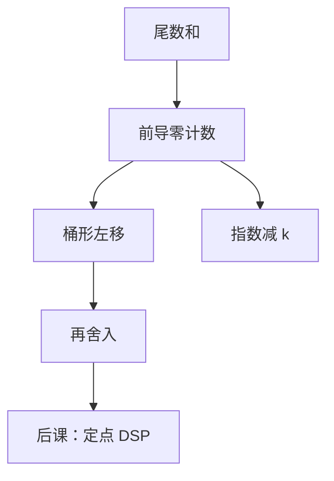

# 前导零计数与规格化

  
有效减法之后，尾数前面可能空出许多零；先数有多少个，再一次左移，指数跟着减，规格化才不是逐位试探。

  <footer>—— 据 Harris and Harris, Digital Design and Computer Architecture；Ercegovac and Lang, Digital Arithmetic；IEEE Std 754-2008 整理</footer>

[上一课](/cs/fp-exceptions)在舍入之后采样下溢与不精确。[浮点加法器](/cs/fp-adder)已经说：对消后要左规。缺口是硬件：**前导零计数（LZC）** 把移位量一次算出来，而不是循环左移直到最高位为 1。

## 问题

有效减的尾数和可能是 $0.0001\ldots$ 形式。逐位规格化要 $\Theta(n)$ 拍，与组合加法器的设计目标冲突。LZC：组合优先级编码器，输出前导零个数 $k$，尾数左移 $k$，指数减 $k$。若 $k$ 大于指数能减的量，结果变成非规格化或零，并影响[下溢标志](/cs/fp-exceptions)。缺口不是 754 的隐藏位定义，而是这条优先级编码路径的延迟——它常与对阶移位器对称，是浮点加的关键路径之一。

### LZC 不是「整数 clz 指令的软件仿真」

ISA 上的 `clz`（后课位操作扩展）与 FPU 内部 LZC 可以共用同一类电路，但浮点规格化还要改指数、处理全零（和为 0 则指数走零编码，不左移 24 位）。把规格化理解成编译器插入 `clz`，软浮点可以，硬 FPU 是数据通路上的固定级。

Harris 用优先级编码器教 LZC。Ercegovac/Lang 把规格化写成算术算法步骤。754 区分规格化与非规格化编码，电路必须两者都能递送。

## 方法

尾数（含保护位）进前导零/前导一检测。全零：结果 ±0，清尾数。否则桶形左移 $k$，指数减 $k$；若指数将穿过 0，改为非规格化右移规则（指数钉在 min，隐藏位为 0）。右规（乘/加进位）是固定移 1 或 2 位，通常不用完整 LZC。

FMA 有效减同样走 LZC；乘积在 $[1,4)$ 时最多右规 1 位，LZC 不是乘路径的主角。

## 机制

后课定点 DSP 常不做规格化，小数点钉死，溢出走饱和——对照本课：浮点用指数把动态范围换成分档精度。整数 `clz` 在 ISA 对照课才会作为用户指令出现；本课只为 FPU 内部服务。

延迟：LZC + 桶形移位 ≈ 对阶移位器，近路径加法器因此难做得很浅。这是浮点加比整数加慢的结构原因之一。

## 边界

本课不把 Lod（leading-one detector）的每级电路画成晶体管，不讨论预测规格化（提前猜 $k$）。不把 subnormal 的刷新延迟（微结构上的微码协助）写成 754 语义。

后课默认：规格化左移量由 LZC 一次给出；指数不够减则走非规格化或零。

## 小结

- 对消后的左规依赖前导零计数，不是逐位循环。
- $k$ 同时驱动移位与指数；下溢在此分叉。
- 定点通路没有这一级，下一课对照。
- 出处：Harris and Harris；Ercegovac and Lang；IEEE 754-2008。
