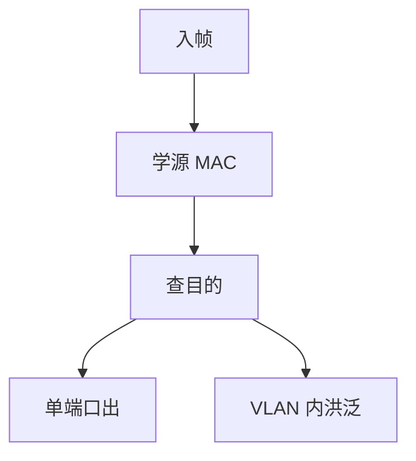

# MAC 学习与洪泛

源地址写入入端口的转发表，目的命中则单播，未知、广播、组播则洪泛；表会老化，环会让表振荡。

<footer>—— 据 Kurose and Ross 交换章；IEEE 802.1Q 转发表条款整理</footer>

[上一课](/cs/rstp-mstp)保证无环之后，洪泛才安全。主干[CSMA 与交换](/cs/csma-switch) 已给过学习直觉。缺口是**表项生命周期与洪泛集合**：老化、VLAN 隔离、未知单播行为、与 LACP 逻辑口。本课不把交换芯片背板写完。

## 问题

帧进来：学源 MAC → 查目的。命中且出口≠入口则转发；同口则过滤（到自己）。未命中：向该 VLAN 内除入口外的转发态口洪泛。老化（常见 300 s）防止主机搬家后黑洞。RSTP 拓扑变更缩短老化，否则帧仍从旧口出。

组播若无 IGMP 窥探（后课）当广播洪泛。这是二层默认，不是 bug。

表容量有限：溢出则更多未知洪泛，像回到集线器。CAM 耗尽攻击是安全课对象，本课只钉机制。

### 学源查宿

未知单播在 VLAN 内洪泛；表满则更像集线器。TCN 缩短老化，否则走旧口。ARP 表在主机，交换机只搬 MAC。

## 方法

画：学习、查找、洪泛、老化、TCN 冲刷。对照路由器：路由器不因源 IP 学出接口来转发（除某些特殊），交换机必须学。LACP：学在逻辑口上，哈希再选成员。

方法止于选定对象与对照；机制才说它如何嵌入已有分层与主干课。

## 机制

巨帧、PAUSE 不改学习键：键是 MAC+VLAN。LLDP 源 MAC 也会被学到，除非控制帧另通道。生成树阻塞口不学习数据，仍可收 BPDU。

未知单播洪泛会把流量送到所有接入口：大二层数据中心的痛点，后课 VXLAN/EVPN 用控制面分发 MAC 来收敛洪泛。

## 边界

本课不引入 EVPN 路由类型。交换机架构与背板是下一课。后课默认：学习+老化+洪泛是二层转发的全部控制面（无路由协议）。

不要把 MAC 表当成 ARP 表：ARP 在主机把 IP 映到 MAC；交换机只搬 MAC。

上一课留下的缺口在本课收口；「MAC 学习与洪泛」进入后课词汇表后只引用。文献用来钉对象与边界，不把本课写成该主题的独立综述。下一课[交换机架构与背板](/cs/switch-fabric)。

## 小结

- 学源、查宿；未知则 VLAN 洪泛。
- 老化与 TCN 防止走旧口。
- 表满则洪泛增多。
- 后课只引用本课钉死的对象，不从该领域总问题重开。
- 出处：Kurose and Ross；IEEE 802.1Q。
